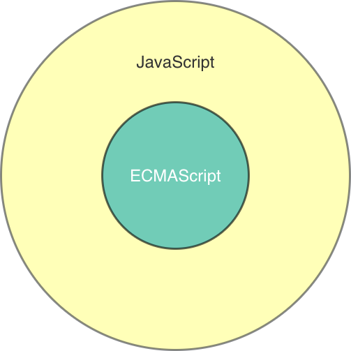

# JavaScriptとは {#what-is-javascript}

JavaScriptはウェブブラウザの中で動くプログラミング言語として知られています。
ウェブサイトで操作をしたら表示が書き換わったり、ウェブサイトのサーバと通信してデータを取得したりと現在のウェブサイトには欠かせないプログラミング言語です。
このようなJavaScriptを活用してアプリケーションのように操作できるウェブサイトをウェブアプリといいます。

さらに、JavaScriptはウェブブラウザだけではなく、Node.jsというサーバ側のアプリケーションを作る仕組みでも利用されています。また、デスクトップアプリやスマートフォンアプリ、IoT（Internet of Things）デバイスでもJavaScriptを使って動かせるものがあります。
このように、JavaScriptはかなり幅広い環境で動いているプログラミング言語で、さまざまな種類のアプリケーションを作成できます。

## JavaScriptとECMAScript {#javascript-ecmascript}

JavaScriptという言語は[ECMAScript][]という仕様によって動作が決められています。
[ECMAScript][]という仕様では、どの実行環境でも共通な動作のみが定義されているため、基本的にどの実行環境でも同じ動作をします。

一方で、実行環境によって異なる部分もあります。
たとえば、ブラウザではUI（ユーザーインターフェース）を操作するためのJavaScriptの機能が定義されていますが、サーバ側の処理を書くNode.jsではそれらの機能は不要です。
このように、実行環境によって必要な機能は異なるため、それらの機能は実行環境ごとに定義（実装）されています。

そのため、「ECMAScript」はどの実行環境でも共通の部分、「JavaScript」はECMAScriptと実行環境の固有機能も含んだ範囲というのがイメージしやすいでしょう。



ECMAScriptの仕様で定義されている機能を学ぶことで、どの実行環境でも対応できる基本的な部分を学べます。
この書籍では、この違いを明確に区別する必要がある場合は「ECMAScript」と「JavaScript」という単語を使い分けます。
そうでない場合は、「JavaScript」という単語を使います。

また、このECMAScriptという仕様（共通の部分）も毎年アップデートされ、新しい文法や機能が追加されています。
そのため、実行環境によっては古いバージョンのECMAScriptを実装したものとなっている場合があります。
ECMAScriptは2015年にECMAScript 2015（ES2015）として大きくアップデートされた仕様が公開されました。

今からJavaScriptを学ぶなら、ES2015以降を基本にしたほうがわかりやすいため、この書籍はES2015に基づいた内容となっています。
また、既存のコードはES2015より前のバージョンを元にしたものも多いため、それらのコードに関しても解説しています。

まずは、JavaScript（ECMAScript）とはどのような言語なのかを大まかに見ていきます。

## JavaScriptってどのような言語？ {#about-javascript}

JavaScriptは、もともとNetscape Navigatorというブラウザのために開発されたプログラミング言語です。
他のプログラミング言語であるC、Java、Self、Schemeなどの影響を受けています。

JavaScriptは、大部分がオブジェクト（値や処理を1つにまとめたものと考えてください）であり、そのオブジェクト同士のコミュニケーションによって成り立っています。
オブジェクトには、ECMAScriptの仕様として定められたオブジェクト、
実行環境が定義したオブジェクト、ユーザ（つまりあなたです）の定義したオブジェクトが存在します。

「[第一部: 基本文法][]」ではECMAScriptの定義する構文やオブジェクトを学んでいきます。
「[第二部: 応用編（ユースケース）][]」ではブラウザやNode.jsといった実行環境が定義するオブジェクトを学びながら、小さなアプリケーションを作成していきます。
ユーザの定義したオブジェクトは、コードを書いていくと自然と登場するため、適宜見ていきます。

次に、JavaScriptの言語的な特徴を簡単に紹介していきます。

まず、JavaScriptは大文字小文字を区別します。
たとえば、次のように`name`という変数を大文字と小文字で書いた場合に、
それぞれは別々の名前の変数として認識されます。

```js
// `name`という名前の変数を宣言
const name = "azu";
// `NAME`という名前の変数を宣言
const NAME = "azu";
```

また、大文字で開始しなければならないといった命名規則が意味をもつケースはありません。
そのため、あくまで別々の名前として認識されるというだけになっています。
（詳細は「[変数と宣言][]」の章で解説します）

また、JavaScriptには特別な意味をもつキーワード（または予約語）が存在します。
このキーワードと同じ名前の変数や関数は宣言できません。
先ほどの、変数を宣言する`const`もキーワードのひとつとなっています。
そのため、`const`という名前の変数名は宣言できません。

JavaScriptは、文（Statement）ごとに処理していき、文はセミコロン（`;`）によって区切られます。
特殊なルールにもとづき、セミコロンがない文も、行末に自動でセミコロンが挿入されるという仕組みも持っています。[^1]
しかし、暗黙的なものへ頼ると意図しない挙動が発生するため、セミコロンは常に書くようにします。
（詳細は「[文と式][]」の章で解説します）

また、スペース、タブ文字などは空白文字（ホワイトスペース）と呼ばれます。
空白文字をいくつ文の中に置いても挙動に違いはありません。

JavaScriptの実行コンテキストとして"Script"と"Module"があります。
この2つの実行コンテキストの違いは意識しなくても問題はありません。

"Module"の実行コンテキストは、JavaScriptをモジュールとして実行するために、ECMAScript 2015で導入されたものです。
"Module"の実行コンテキストでは、古く安全でない構文や機能は、一部禁止されています。
（詳細は「[モジュール][]」の章で解説します）

最後に、JavaScriptには**strict mode**という実行モードが存在しています。
名前のとおり厳格な実行モードで、古く安全でない構文や機能が一部禁止されています。
"Module"の実行コンテキストでは、このstrict modeがデフォルトとなっています。

`"use strict"`という文字列をファイルまたは関数の先頭に書くことで、そのスコープにあるコードはstrict modeで実行されます。

```js
"use strict";
// このコードはstrict modeで実行される
```

strict modeでは、`eval`や`with`といったレガシーな機能や構文を禁止します。
また、あきらかな問題を含んだコードに対しては早期的に例外を投げることで、開発者が間違いに気づきやすくしてくれます。

たとえば、次のような`var`などのキーワードを含まずに変数を宣言しようとした場合に、strict modeでは例外が発生します。
（strict modeでない場合は、例外が発生せずにグローバル変数が作られます。）

```js
"use strict";
mistypedVariable = 42; // => ReferenceError
```

このように、strict modeでは開発者が安全にコードを書けるように、JavaScriptの落とし穴を一部ふさいでくれます。
そのため、常にstrict modeで実行できるコードを書くことが、より安全なコードにつながります。

本書では、明示的に「strict modeではない」ことを宣言した場合を除き、
すべてstrict modeとして実行できるコードを扱います。

最後に、JavaScriptの仕様であるECMAScriptは毎年更新され、JavaScriptには新しい構文や機能が増え続けています。
そのため、この書籍で学んだ後もまだまだ知らなかったことが出てくるはずです。

一方で、ECMAScriptは後方互換性が慎重に考慮されているため、過去に書いたJavaScriptのコードが動かなくなる変更はほとんど入りません。
そのため、この書籍で学んだことのすべてが無駄になることはありません。


[^1]: Automatic Semicolon Insertionと呼ばれる仕組みです。

[Ecma International]: http://www.ecma-international.org/  "Ecma International"
[ECMAScript]: http://www.ecma-international.org/publications/standards/Ecma-262.htm  "Standard ECMA-262"
[第一部: 基本文法]: ../README.md
[第二部: 応用編（ユースケース）]: ../../use-case/README.md
[変数と宣言]: ../variables/README.md
[文と式]: ../statement-expression/README.md
[モジュール]: ../../use-case/module/README.md