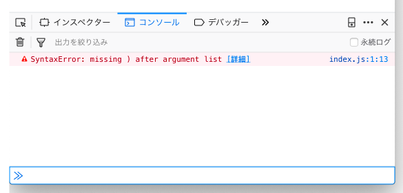

# 値の評価と表示 {#read-eval-print}

変数宣言を使うことで値に名前をつける方法を学びました。
次はその値をどのように評価するかについてです。

値の評価とは、次のような入力を評価して結果を返すことを示しています。

- `1 + 1` という式を評価したら `2` という結果を返す
- `bookTitle` という変数を評価したら、変数に代入されている値を返す

この値の評価方法を見ていくため、実行環境でJavaScriptを実行する方法を見ていきます。

## ブラウザでJavaScriptを実行する {#execute-js-on-browser}

まずはブラウザ上でJavaScriptのコードを実行してみましょう。
この書籍ではブラウザとして[Firefox][]を利用します。
次のURLからFirefoxをダウンロードし、インストールしてください。

- Firefox: <https://www.mozilla.org/ja/firefox/>

ブラウザでJavaScriptを実行する方法としては大きく分けて2つあります。
1つ目はブラウザの開発者ツールのコンソール上でJavaScriptコードを評価する方法です。
2つ目はHTMLファイルを作成しJavaScriptコードを読み込む方法です。

### ブラウザの開発者ツールのコンソール上でJavaScriptコードを評価する方法 {#repl-on-browser}

ブラウザやNode.jsなど多くの実行環境には、コードを評価してその結果を表示するREPL（read–eval–print loop）と呼ばれる開発者向けの機能があります。
Firefoxでは開発者ツールの**Webコンソール**と呼ばれる機能にREPL機能が含まれています。

Firefoxの開発者ツールは次のいずれかの方法で開きます。

- Firefox メニュー（メニューバーがある場合や macOS では、ツールメニュー）の Web 開発サブメニューで "Web コンソール" を選択する
- キーボードショートカット Ctrl+Shift+K（macOS では Command+Option+K）を押下する

詳細は"[Webコンソールを開く][]"を参照してください。

- [ ] スクリーンショット

"コンソール"を選択すると、コマンドライン（二重山かっこ`»`から始まる欄）に任意のコードを入力し評価できます。
このコマンドラインがブラウザにおけるREPL機能です。

REPLに`1`という値を入力すると、その評価結果である`1`が次の行に表示されます。

```
» 1
1
```

`1 + 1` という式を入力すると、その評価結果である`2`が次の行に表示されます。

```
» 1 + 1
2
```

次に`const`キーワードを使って`bookTitle`という変数を宣言してみると、`undefined`という結果が次の行に表示されます。
変数宣言は変数名と値を関連づけるだけであるため、変数宣言自体は何も値を返さないという意味で`undefined`が結果になります。
REPLではそのまま次の入力ができるため、`bookTitle`という入力をすると、先ほど変数に入れた`"JavaScriptの本"`という結果が次の行に表示されます。

```
» const bookTitle = "JavaScriptの本";
undefined
» bookTitle
"JavaScriptの本"
```

このようにコマンドラインのREPL機能では、JavaScriptのコードを1行ごとに実行できます。
Shift + Enterで改行して複数行の入力もできます。
好きな単位でJavaScriptのコードを評価できるため、コードの動きを簡単に試したい場合などに利用できます。

注意点としては、REPLではそのREPLを終了するまで`const`キーワードなどで宣言した変数が残り続けます。
たとえば、`const`での変数宣言は同じ変数名を二度定義できないというルールでした。
そのため1行づつ実行しても同じ変数名の定義を行うと構文エラー（`SyntaxError`）となります。

```
» const bookTitle = "JavaScriptの本";
undefined
» const bookTitle = "JavaScriptの本";
SyntaxError: redeclaration of const bookTitle
```

ブラウザでは、ページをリロードするとREPLの実行状態もリセットできます。
`redeclaration`（再定義）に関するエラーメッセージが出た際にはページをリロードしてみてください。

### HTMLファイルを作成しJavaScriptコードを読み込む方法 {#js-in-html}

REPLはあくまで開発者向けの機能であるため、ウェブサイトではJavaScriptはHTMLからスクリプトとして読み込み実行します。
ここでは、HTMLとJavaScriptファイルを使ったJavaScriptコードの実行方法を見ていきます。

HTMLファイルとJavaScriptファイルの2種類を使い、JavaScriptのコードを実行する準備をしていきます。
ファイルを作成するため[Atom][]や[Visual Studio Code][]などのJavaScriptなどに対応したエディタを用意しておくとスムーズです。
エディタはどんなものでも問題ありませんが、必ずUTF-8の文字コードでファイルを保存してください。

ファイルを作成するディレクトリはどんな場所でも問題ありませんが、ここでは`example`という名前のディレクトリにファイルを作成していきます。

まずはJavaScriptファイルとして`index.js`ファイルを`example/index.js`というパスに作成します。
`index.js`の中には次のようなコードを書いておきます。

```js
1;
```

次にHTMLファイルとして`index.html`ファイルを`example/index.html`というパスに作成します。
このHTMLファイルから先ほど作成した`index.js`ファイルを読み込み実行します。
`index.html`の中には次のようなコードを書いておきます。

[include, title:"index.html"](src/example/index.html)

重要なのは`<script src="./index.js"></script>`という記述です。
これは同じディレクトリにある`index.js`という名前のJavaScriptファイルをスクリプトとして読み込むという意味になります。

最後にブラウザで作成した`index.html`を開きます。
HTMLファイルを開くには、ブラウザにHTMLファイルをドラッグアンドドロップまたはファイルメニューから"ファイルを開く"でHTMLファイルを選択します。
HTMLファイルを開いた際に、ブラウザのアドレスバーには`file:///`から始まるローカルファイルのファイルパスが表示されます。

先ほどと同じ手順で"Web コンソール"を開いてみると、コンソールには何も表示されていないはずです。
REPLでは自動で評価結果のコンソール表示まで行いますが、JavaScriptコードとして読み込んだ場合は勝手に評価結果を表示されることはありません。
あくまで自動表示はREPLの機能です。そのため多くの実行環境では**コンソール表示**するためのAPI（機能）が存在しています。

## Console API {#console-api}

JavaScriptの多くの実行環境では、Console APIが**コンソール表示**を行うAPIとなっています。
`console.log(引数)`の引数にコンソール表示したい値を入れることで、評価結果がコンソールに表示されます。

先ほどの`index.js`の中身を次のように書きかえます。
そしてページをリロードする `1` という値を評価した結果がWebコンソールに表示されます。

{{book.console}}
[import, console-example.js](./src/console-example.js)

次のように引数に式を書いた場合は先に引数（`(`と`)`の間に書かれたもの）の式を評価してから、その結果をコンソールに表示します。
そのため、`1 + 1` の評価結果として `2` がコンソールに表示されます。

{{book.console}}
[import, console-expression-example.js](./src/console-expression-example.js)

同じように引数に変数を渡すこともできます。
この場合もまず先に引数である変数を評価してから、その結果をコンソールに表示します。

{{book.console}}
[import, console-variable-example.js](./src/console-variable-example.js)

Console APIは原始的なプリントデバッグとして利用できます。
「この値は何だろう」と思ったらコンソールに表示すると解決する問題は多いです。
またJavaScriptの開発環境は高機能化が進んでいるため、Console API以外にもさまざまな機能がありますがここでは詳細は省きます。

この書籍では、コード内で評価結果を表示するためにConsole APIを利用していきます。

すでに何度も登場していますが、コード内のコメントで`// => 評価結果`と書いている場合があります。
このコメントは、その左辺にある値を評価した結果またはConsole APIで表示した結果を掲載しています。

{{book.console}}
```js
// 式の評価結果の例（コンソールには表示されない）
1; // => 1
// 変数の評価結果の例（コンソールには表示されない）
const total = 42 + 42;
// totalの評価結果は84
total; // => 84
// Console APIでコンソールに表示する例
console.log("JavaScript"); // => "JavaScript"
```

## ウェブ版の書籍でコードを実行する {#execute-on-web}

<!-- TODO: Web版のみ表示する -->

ウェブ版の書籍では実行できるサンプルコードには**実行**というボタンが配置されています。
このボタンでは実行するたびに毎回新しい環境を作成して実行するため、REPLで発生する変数の再定義といった問題はおきません。

一方で、REPLと同じように`1`というコードを実行すると`1`という評価結果を得られます。
またConsole APIにも対応しています。サンプルコードを改変して実行するなどよりコードへの理解を深めるために利用できます。

{{book.console}}
```js
console.log("Console APIで表示");
// 値を評価した場合は最後の結果が表示される
42; // => 42
```

## コードの評価とエラー {#eval-code-and-error}

JavaScriptのコードを実行したときにエラーメッセージが表示されて意図したように動かなかった場合もあるはずです。
プログラムを書くときに一度もエラーを出さずに書き終えることは殆どありません。
特に新しいプログラミング言語を学ぶ際にはトライアンドエラー（試行錯誤）することはとても重要です。

エラーメッセージがWebコンソールに表示された際にはあわてずにそのエラーメッセージを読むことで多くの問題は解決できます。
またエラーには多く分けて構文エラーと実行時エラーの2種類があります。
ここではエラーメッセージの簡単な読み方を知り、そのエラーを修正する足がかりを見ていきます。

### 構文エラー {#syntax-error}

構文エラーは書かれたコードの文法が間違っている場合に発生するエラーです。

JavaScriptエンジンは、コードをパース（解釈）してから、プログラムとして実行できる形に変換し実行します。
パースを行う際にコードの文法に問題があると、JavaScriptエンジンはそのコードをパースできないため、構文エラーが発生します。

次のコードでは、関数呼び出しに`)`をつけ忘れているため構文エラーが発生します。

{{book.console}}
<!-- doctest:Error -->
[include, title:"index.js"](src/invalid/syntax-error/index.js)



Firefoxでこのコードを実行すると次のようなエラーメッセージがでます。

> SyntaxError: missing ) after argument list[詳細] index.js:1:13 

エラーメッセージはブラウザによって多少の違いはありますが、基本的には同じ形式のメッセージになります。
このエラーメッセージをパーツごとに見てみると次のようになります。

```
SyntaxError: missing ) after argument list[詳細] index.js:1:13 
^^^^^^^^^^^  ^^^^^^^^^^^^^^^^^^^^^^^^^^^^^      ^^^^^^^^　^^^^
エラーの種類                |                        | 　行番号:列番号
                  エラー内容の説明                 ファイル名
```

| メッセージ | 意味 |
| -- | -- |
| `SyntaxError: missing ) after argument list` | エラーの種類は`SyntaxError`で、関数呼び出しの`)`が足りないこと |
| `index.js:1:13 ` | 例外が`index.js`の1行目13列目で発生したこと |

Firefoxは**[詳細]**というリンクがエラーメッセージによっては表示されます。
この**[詳細]**リンクはエラーメッセージに関するMDNの解説ページへのリンクとなっています。
この例のエラーメッセージでは次の解説ページへリンクされています。

- <https://developer.mozilla.org/ja/docs/Web/JavaScript/Reference/Errors/Missing_parenthesis_after_argument_list>

このエラーメッセージや解説ページから、関数呼び出しの`)`が足りないため構文エラーとなっていることがわかります。
そのため、次のように足りない`)`を追加することでエラーを修正できます。

{{book.console}}
```js
console.log(1);
```

構文エラーによっては少しエラーメッセージから意味が読み取りにくいものもあります。

次のコードでは、`const`を`cosnt`とタイプミスしているため構文エラーが発生しています。

{{book.console}}
<!-- doctest:Error -->
[include, title:"index.js"](./src/invalid/syntax-error-typo/index.js)

> SyntaxError: unexpected token: identifier[詳細] index.js:1:6 

| メッセージ | 意味 |
| -- | -- |
| `SyntaxError: unexpected token: identifier` | エラーの種類は`SyntaxError`で、予期しないものが識別子（変数名）に指定されている |
| `index.js:1:6` | 例外が`index.js`の1行目6列目で発生したこと |

プログラムをパースする際に`index.js:1:6`で予期しない（構文として解釈できない）識別子が見つかったため、構文エラーが発生したという意味になります。
1行目6列目（行は1から、列は0からカウントする）である`a`という文字列がおかしいということになります。
しかし、実際には`cosnt`というタイプミスがこの構文エラーの原因です。

なぜこのようなエラーメッセージになるかというと、`cosnt`（`const`のタイプミス）はキーワードではないため、ただの変数名として解釈されます。
そのため、このコードは次のように解釈されそのような文法は認められないということで構文エラーとなっています。

<!-- doctest:Error -->
[include, reference-error.js](src/invalid/reference-error.js)

このようにエラーメッセージとエラーの原因は必ずしも一致しません。
しかし、構文エラーの原因はコードの書き間違いであることが殆どです。
そのため、エラーが発生した位置やその周辺を注意深く見ることで、エラーの原因を特定できます。

### 実行時エラー {#runtime-error}

実行時エラーはプログラムを実行している最中に発生するエラーです。
実行時（ランタイム）におきるエラーであるためランタイムエラーと呼ばれることもあります。
APIに渡す値の問題から起きる`TypeError`や存在しない変数を参照しようとして起きる`ReferenceError`などさまざまな種類があります。

実行時エラーが発生した場合は、そのコードは構文としては正しい（構文エラーではない）ですが、別のことが原因でエラーが発生しています。

次のコードでは`a`という存在しない変数を参照したため`ReferenceError`になっています。

{{book.console}}
<!-- doctest:Error -->
[include, title:"index.js"](./src/runtime-error/index.js)

> ReferenceError: a is not defined[詳細]  index.js:1:1

| メッセージ | 意味 |
| -- | -- |
| `ReferenceError: a is not defined` | エラーの種類は`ReferenceError`で、`a`という未定義の識別子を参照した |
| `index.js:1:1` | 例外が`index.js`の1行目1列目で発生したこと |

`a`という変数や関数が存在するかは実行してみないとわかりません。
多くの実行環境がConsole APIのようなビルトインの機能を提供しているように、`a`という名前の機能を提供する実行環境も考えられます。
そのため、実行して`a`という識別子を参照したときに初めて存在するか否かが判明して、存在しない場合は`ReferenceError`となります。

このように、実行時エラーは該当する箇所を実行するまでエラーになるかがわからない場合も多いのです。
そのため、どこまではちゃんと実行できたか順番に追っていくような、エラーの原因を特定する作業が必要になっている場合があります。
このようなエラーの原因を特定し、修正する作業のことを**デバッグ**と呼びます。

実行時エラーは構文エラーに比べてエラーの種類も多く、その原因もプログラムの数だけあります。
エラーの原因を見つけることが大変な場合も多いですが、JavaScriptはとても良く使われている言語なので、ウェブ上には類似するエラーを報告している人も多いです。
そのため、エラーメッセージで検索をしてみると、類似するエラーの原因と解消方法が見つかるケースもあります。

## まとめ {#conclusion}

ブラウザ上でJavaScriptを実行する方法として開発者ツールを使う方法とHTMLからJavaScriptファイルを読み込む方法を紹介しました。
「第1部 基本文法」で紹介するサンプルコードは基本的にこれらの方法で実行できます。
サンプルコードを自分なりに改変して実行するなどするとより理解が深くなるため、サンプルコードの動作を自分自身で確認してみてください。

コードを実行してエラーが発生した場合にはエラーメッセージや位置情報などが表示されます。
これらのエラー情報を使ってデバッグすることでエラーの原因を取り除けるはずです。

JavaScriptにおいては多くのエラーはすでに類似するケースがウェブ上に報告されています。
構文エラーや実行時エラーの典型的なものはMDNの[JavaScript エラーリファレンス][]にまとめられています。
また[Google][]、[GitHub][]、[Stack Overflow][]などでエラーメッセージを検索することで、エラーの原因を見つけられることもあります。

エラーがWebコンソールに表示されているならば、そのエラーは修正できます。
エラーを過度に怖がる必要はありません。エラーメッセージなどのヒントを使ってエラーを修正していけるようにしましょう。


[第1部 基本文法]: ../README.md
[Firefox]: https://www.mozilla.org/ja/firefox/
[Webコンソールを開く]: https://developer.mozilla.org/ja/docs/Tools/Web_Console/Opening_the_Web_Console
[Atom]: https://atom.io/
[Visual Studio Code]: https://code.visualstudio.com/
[Google]: https://www.google.com/
[Stack Overflow]: https://stackoverflow.com/
[GitHub]: https://github.com/
[JavaScript エラーリファレンス]: https://developer.mozilla.org/ja/docs/Web/JavaScript/Reference/Errors
