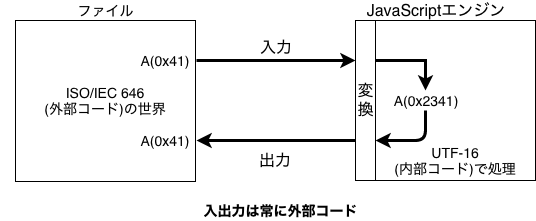
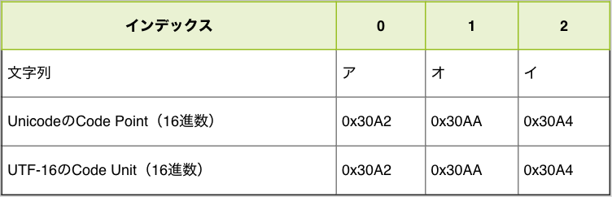
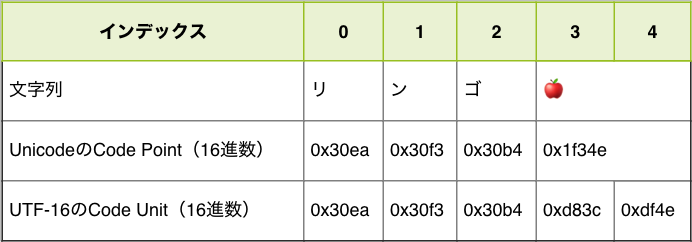

# 文字列とUnicode {#string-unicode}

「[文字列][]」の章で紹介したように、JavaScriptは文字コードとしてUnicodeを採用し、エンコード方式としてUTF-16を採用しています。
この文字コードはJavaScriptの内部的に文字列を扱う際のもの（内部コード）です。
そのため、コードを書いたファイル自体の文字コード（外部コード）は、基本的にはどのような文字コードでも問題ありません。

次の図はコードを書いたファイルの文字コードがISO/IEC 646（外部コード）であった場合に、JavaScriptエンジンがどのように処理するかを表した図です。
たとえば、外部コードでは`0x41`として扱われていた`A`という文字は、JavaScriptエンジンで扱う際にはUTF-16で`A`を表すCode Unitの`0x2341`へと変換されます。そして、JavaScriptでの処理が終わったあとは、ふたたび外部コードに合わせた`0x41`という値へと変換され出力されます。



この図からも分かるように、JavaScriptエンジン上で動作するJavaScriptのコードは、UTF-16で変換された文字列を扱っています。

「[文字列][]」の章ではこの文字コードは意識していなかったように、内部的にどのような文字コードで扱っているかは意識せずに文字列処理はできます。
しかし、JavaScriptのStringオブジェクトにはこの文字コード（Unicode）に特化したAPIもあります。
また、絵文字を含む特定の文字を扱う際や「文字数」を数えるということを行う場合には、内部コードを意識しないといけない場面があります。

この章では、文字列におけるUnicodeを意識しないといけない場面について見ていきます。
また、Unicode自体もECMAScriptと同じように歴史がある仕様であり、Unicodeのすべてを紹介するには膨大な文字列が必要になります。
そのため、この章はJavaScriptにおけるUnicodeとUTF-16に話を限定しています。

Unicodeの歴史を含めた文字コード自体について詳しく知りたい方は「[プログラマのための文字コード技術入門][]」や「[文字コード「超」研究][]」等を参照してください。

## Code Point {#code-point}

Unicodeはすべての文字（制御文字などの画面に表示されない文字も含む）に対してIDを定義する目的で策定されている仕様です。
この「文字」に対する「一意のID」のことを**Code Point**（符号位置）と呼びます。

JavaScriptでは、ECMAScript 2015からこのCode Pointを扱うビルトインメソッドが追加されています。
これらのメソッドを使うことで、文字列とCode Pointを相互変換できます。

ES2015で追加された`String#codePointAt`メソッドは、文字列の指定インデックスにある文字のCode Pointの値を返します。

{{book.console}}
```js
// 文字列"あ"のインデックスが0（"あ"）のCode Pointを取得
console.log("あ".codePointAt(0)); // => 12354
```

一方で、`String.fromCodePoint`メソッドは、指定したCode Pointに対応する文字を返します。

{{book.console}}
```js
// Code Pointが`12354`の文字を取得する
console.log(String.fromCodePoint(12354)); // => "あ"
// `12354`を16進数リテラルで表記しても同じ結果
console.log(String.fromCodePoint(0x3042)); // => "あ"
```

また、文字列リテラル中にはUnicodeエスケープシーケンスで、直接Code Pointを書くこともできます。
Code Pointは`\u{Code Pointの16進数の値}`のようにエスケープシーケンスとして記述できます。
Unicodeエスケープシーケンスでは、Code Pointの16進数の値が必要となります。
そのため、`toString`メソッドで16進数の値を算出する方法も合わせて書いています。

{{book.console}}
```js
// "あ"のCode Pointは12354
const codePointOfあ = "あ".codePointAt(0);
// 12354の16進数表現は"3042"
const hexOfあ = codePointOfあ.toString(16);
console.log(hexOfあ);// => "3042"
// Unicodeエスケープで"あ"を表現できる
console.log("\u{3042}"); // => "あ"
```

## Code PointとCode Unitの違い {#code-point-is-not-code-unit}

Code Point（符号位置）について紹介しましたが、JavaScriptの文字列の構成要素はUTF-16で変換されたCode Unit（符号単位）を要素です。（詳細は「[文字列][]」の章を参照）
多くの文字列については、Code Point（符号位置）とCode Unit（符号単位）は結果として同じ値となります。

次のコードでは、文字列の各要素をCode PointとCode Unitとして表示しています。
`convertCodeUnits`関数は文字列をCode Unitの配列にし、`convertCodePoints`関数は文字列をCode Pointの配列にしています。それぞれの関数の実装はまだ理解しなくても問題ありません。

{{book.console}}
```js
// 文字列をCode Unit(16進数)の配列にして返す
function convertCodeUnits(string) {
    const codeUnits = [];
    for (let i = 0; i < string.length; i++) {
        codeUnits.push(string.charCodeAt(i).toString(16));
    }
    return codeUnits;
}
// 文字列をCode Point(16進数)の配列にして返す
function convertCodePoints(string) {
    return Array.from(string).map(char => {
        return char.codePointAt(0).toString(16);
    });
}

const string = "アオイ";
const codeUnits = convertCodeUnits(string);
console.log(codeUnits); // => ["30A2", "30AA", "30A4"]
const codePoints = convertCodePoints(string);
console.log(codePoints); // => ["30A2", "30AA", "30A4"]
```

実行した結果をまとめてみると、この文字列においてはCode PointとCode Unitが同じ値になっていることがわかります。



しかし、文字列によってはCode PointとCode Unitが異なる値となる場合があります。

先ほどと同じ関数を使い、`リンゴ🍎`（リンゴの絵文字）という文字列を構成するCode UnitとCode Pointを見比べてみます。

{{book.console}}
```js
// 文字列をCode Unit(16進数)の配列にして返す
function convertCodeUnits(string) {
    const codeUnits = [];
    for (let i = 0; i < string.length; i++) {
        codeUnits.push(string.charCodeAt(i).toString(16));
    }
    return codeUnits;
}
// 文字列をCode Point(16進数)の配列にして返す
function convertCodePoints(string) {
    return Array.from(string).map(char => {
        return char.codePointAt(0).toString(16);
    });
}

const string = "リンゴ🍎";
const codeUnits = convertCodeUnits(string);
console.log(codeUnits); // => ["30ea", "30f3", "30b4", "d83c", "df4e"]
const codePoints = convertCodePoints(string);
console.log(codePoints); // => ["30ea", "30f3", "30b4", "1f34e"]
```

実行した結果をまとめてみると、この絵文字を含む文字列においてはCode PointとCode Unitが異なる値となることがわかります。



具体的には、Code Pointの要素数が4つなのに対して、Code Unitの要素数が5つになっています。
また、Code Pointでは1つのCode Pointが`🍎`に対応していますが、Code Unitでは2つのCode Unitで`🍎`に対応しています。

ある1つの文字に対応するIDであるCode Pointを、16bit（2バイト）のCode Unitで表現するのがUTF-16というエンコード方式です。しかし、16bit（2バイト）で表現できる範囲は、65536種類（2の16乗）です。
現在、Unicodeに登録されているCode Pointは10万種類を超えているため、すべての文字とCode Unitを1対1の関係で表すことができません。

このような場合に、UTF-16では2つCode Unitの組み合わせ（合計4バイト）で1つの文字（1つのCode Point）を表現します。この仕組みを**サロゲートペア**と呼びます。

## サロゲートペア {#surrogate-pair}

複数のCode Unitで1つのCode Pointを表すための仕組み。

## Code Pointの列挙

### length

実際にサロゲートペアのうむによってどのような影響があるかの例。

### 正規表現の`.`

### splitによる"Code Unit"の分割

## おわりに

[文字列]: ../string/README.md

[文字コード「超」研究]: http://www.rutles.net/products/detail.php?product_id=298
[プログラマのための文字コード技術入門]: https://gihyo.jp/book/2019/978-4-297-10291-3