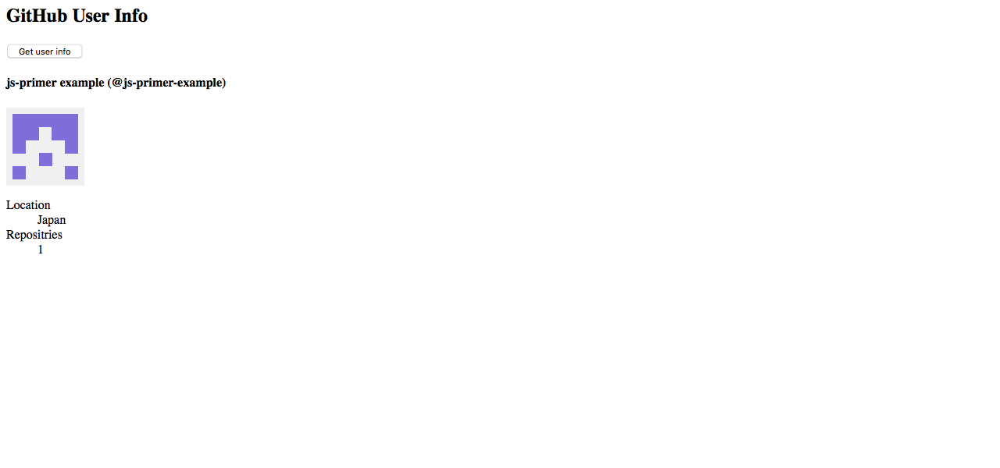

# データを表示する {#display-data}

XHRを使ってサーバーからデータを取得できたので、データをHTMLに整形して表示してみましょう。

## レスポンスをオブジェクトに変換する {#convert-response-to-object}

まずはGitHub APIからのデータをJavaScriptで扱うために、レスポンス文字列をオブジェクトに変換します。
GitHub APIのレスポンスはJSON形式なので、オブジェクトへの変換には[JSON.parse()][]を使います。

<!-- 実際にはrequestできない -->
<!-- doctest:disable -->
```js
request.addEventListener("load", (event) => {
    if (event.target.status !== 200) {
        console.error(`${event.target.status}: ${event.target.statusText}`);
        return;
    }

    const userInfo = JSON.parse(event.target.responseText);
});
```

## HTMLを組み立てる {#markup-html}

HTML文字列の生成にはテンプレートリテラルを使います。
テンプレートリテラルは文字列中の改行が可能なため、HTMLのインデントを表現できて見通しが良くなります。
また、文字列の埋め込みも簡単なため、HTMLのテンプレートに対して動的なデータを当てはめるのに適しています。

次のコードではGitHubのユーザー情報から組み立てるHTMLのテンプレートを宣言しています。

<!-- 差分コードなので -->
<!-- doctest:disable -->
```js
const view = `
<h4>${userInfo.name} (@${userInfo.login})</h4>

<dl>
    <dt>Location</dt>
    <dd>${userInfo.location}</dd>
    <dt>Repositories</dt>
    <dd>${userInfo.public_repos}</dd>
</dl>
`;
```

このテンプレートに`userInfo`オブジェクトを適用すると、次のようなHTML文字列になります。

```html
<h4>js-primer example (@js-primer-example)</h4>

<dl>
    <dt>Location</dt>
    <dd>Japan</dd>
    <dt>Repositories</dt>
    <dd>1</dd>
</dl>
```

## HTML文字列をDOMに追加する {#html-to-dom}

次に、生成したHTML文字列をDOMツリーに追加して表示します。
まずは動的にHTMLをセットするために、目印となる要素をindex.htmlに追加します。
今回は`result`というidを持ったdiv要素（以降`div#result`と表記します）を配置します。

```html
<body>
    <h2>GitHub User Info</h2>

    <button onclick="getUserInfo('js-primer-example');">Get user info</button>

    <div id="result"></div>

    <script src="index.js"></script>
</body>
```

ここから、`div#result`要素の子要素としてHTML文字列を挿入することになります。
[document.getElementById][]メソッドを使い、id属性が設定された要素にアクセスします。
`div#result`要素が取得できたら、先ほど生成したHTML文字列を`innerHTML`プロパティにセットします。

<!-- 差分コードなので -->
<!-- doctest:disable -->
```js
const result = document.getElementById("result");
result.innerHTML = view;
```

JavaScriptによってHTML要素をDOMに追加する方法は、大きく分けて２つあります。
ひとつは、今回のようにHTML文字列を[Element#innerHTML][]プロパティにセットする方法です。
もうひとつは、文字列ではなく[Element][]オブジェクトを生成して[手続き的にツリー構造を構築する][]方法です。
後者はセキュリティ的に安全ですが、コードは少し冗長になります。
今回は`Element#innerHTML`プロパティを使いつつ、セキュリティのためのエスケープ処理を行います。

## HTML文字列をエスケープする {#escape-html}

`Element#innerHTML`に文字列をセットすると、その文字列はHTMLとして解釈されます。
たとえばGitHubのユーザー名に`<`記号や`>`記号が含まれていると、意図しない構造のHTMLになる可能性があります。
これを回避するために、文字列をセットする前に、特定の記号を安全な表現に置換する必要があります。
この処理を一般にHTMLのエスケープと呼びます。

多くのViewライブラリは内部にエスケープ機構を持っていて、動的にHTMLを組み立てるときにはデフォルトでエスケープをしてくれます。
または、[エスケープ用のライブラリ][]を利用するケースも多いでしょう。
今回のように独自実装するのは特別なケースで、一般的にはライブラリが提供する機能を使うのがほとんどです。

次のように、特殊な記号に対するエスケープ処理を`escapeSpecialChars`関数として宣言します。

```js
function escapeSpecialChars(str) {
    return str
        .replace(/&/g, "&amp;")
        .replace(/</g, "&lt;")
        .replace(/>/g, "&gt;")
        .replace(/"/g, "&quot;")
        .replace(/'/g, "&#039;");
}
```

この`escapeSpecialChars`関数を、HTML文字列の中で`userInfo`から値を注入しているすべての箇所で行います。
ただし、テンプレートリテラル中で挿入している部分すべてに関数を適用するのは手間ですし、メンテナンス性もよくありません。
そこで、[テンプレートリテラルをタグ付け][]することで、明示的にエスケープ用の関数を呼び出す必要がないようにします。
タグ付けされたテンプレートリテラルは、テンプレートによる値の埋め込みを関数の呼び出しとして扱えます。

次の`escapeHTML`はテンプレートリテラルにタグ付けするための**タグ関数**です。
タグ関数は第一引数に文字列リテラルの配列、第二引数に埋め込まれる値の配列が与えられます。
`escapeHTML`関数では、文字列リテラルと値が元の順番どおりに並ぶように文字列を組み立てつつ、
値が文字列型であればエスケープするようにしています。

```js
function escapeHTML(strings, ...values) {
    return strings.reduce((result, string, i) => {
        const value = values[i - 1];
        if (typeof value === "string") {
            return result + escapeSpecialChars(value) + string;
        } else {
            return result + String(value) + string;
        }
    });  
}
```

`escapeHTML`関数はタグ関数なので、通常の`()`による呼び出しではなく、テンプレートリテラルに対してタグ付けして使います。
テンプレートリテラルのバッククォート記号の前に関数を書くと、関数がタグ付けされます。

<!-- 差分コードなので -->
<!-- doctest:disable -->
```js
const view = escapeHTML`
<h4>${userInfo.name} (@${userInfo.login})</h4>

<dl>
    <dt>Location</dt>
    <dd>${userInfo.location}</dd>
    <dt>Repositories</dt>
    <dd>${userInfo.public_repos}</dd>
</dl>
`;

const result = document.getElementById("result");
result.innerHTML = view;
```

これでHTML文字列の生成とエスケープができました。
ここまでで、index.jsとindex.htmlは次のようになっています。

[import, index.js](src/index.js)

[import, index.html](src/index.html)

アプリケーションを開いてボタンを押すと、次のようにユーザー情報が表示されます。



[JSON.parse()]: https://developer.mozilla.org/ja/docs/Web/JavaScript/Reference/Global_Objects/JSON/parse
[document.getElementById]: https://developer.mozilla.org/ja/docs/Web/API/Document/getElementById
[Element#innerHTML]: https://developer.mozilla.org/ja/docs/Web/API/Element/innerHTML
[Element]: https://developer.mozilla.org/ja/docs/Web/API/Element
[手続き的にツリー構造を構築する]: https://developer.mozilla.org/ja/docs/Web/API/Node/appendChild
[エスケープ用のライブラリ]: https://github.com/teppeis/htmlspecialchars
[テンプレートリテラルをタグ付け]: https://developer.mozilla.org/ja/docs/Web/JavaScript/Reference/template_strings#タグ付けされたTemplate_literal
