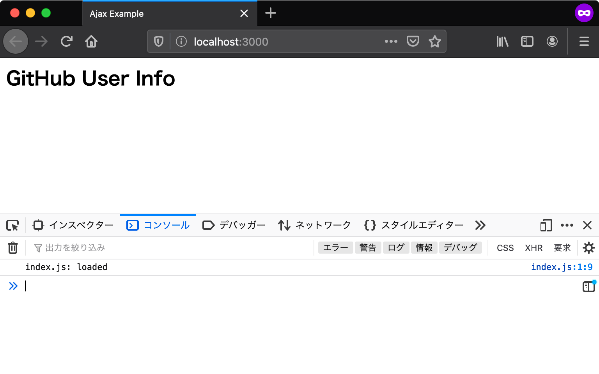

# エントリポイント {#entrypoint}

エントリポイントとは、アプリケーションの中で一番最初に呼び出される部分のことです。
アプリケーションを作成するにあたり、まずはエントリポイントを用意しなければなりません。

Webアプリケーションにおいては、常にHTMLドキュメントがエントリポイントとなります。
ウェブブラウザによりHTMLドキュメントが読み込まれたあとに、HTMLドキュメント中で読み込まれたJavaScriptが実行されます。

## プロジェクトディレクトリを作成 {#create-project-directory}

今回作成するアプリにはHTMLやJavaScriptなど複数のファイルが必要となります。
そのため、まずそれらのファイルを置くためのディレクトリを作成します。

ここでは `ajaxapp` という名前で新しいディレクトリを作成します。ここからは作成した`ajaxapp`ディレクトリ以下で作業していきます。

またこのプロジェクトで作成するファイルは、必ず文字コード（エンコーディング）を**UTF-8**、改行コードを**LF**にしてファイルを保存します。


## HTMLファイルの用意 {#preparing-html}

エントリポイントとして、まずは最低限の要素だけを配置したHTMLファイルを`index.html`というファイル名で作成しましょう。
`body`要素の一番下で読み込んでいる`index.js`が、今回のアプリケーションの処理を記述するJavaScriptファイルです。

[import, title:"index.html"](src/index.html)

次に同じディレクトリに`index.js`というファイルを作成します。
`index.js`にはスクリプトが正しく読み込まれたことを確認できるよう、コンソールにログを出力する処理だけを書いておきます。

[import, title:"index.js"](src/index.js)

ここでの`ajaxapp`ディレクトリのファイル配置は次のようになっていれば問題ありません。

```
ajaxapp
├── index.html
└── index.js
```

次はこの`index.html`をブラウザで表示して、コンソールにログが出力されることを確認していきます。

## ローカルサーバーでHTMLを確認する {#local-server}

ウェブブラウザで`index.html`を開く前に、開発用のローカルサーバーを準備します。 
ローカルサーバーを立ち上げずに直接HTMLファイルを開くこともできますが、その場合`file:///`から始まるURLになります。
`file`スキーマでは[Same Origin Policy][]のセキュリティ制限により、多くの場面でアプリケーションは正しく動作しません。
本章はローカルサーバーを立ち上げた上で、`http`スキーマのURLでアクセスすることを前提としています。

コマンドラインで`ajaxapp`ディレクトリへ移動し、次のコマンドでローカルサーバーを起動します。 
次のコマンドでは、この書籍用に作成された`@js-primer/local-server`というローカルサーバーモジュールをダウンロードと同時に実行します。
まだ`npx`コマンドの用意できていなければ、先に[アプリケーション開発の準備][]を参照してください。

```shell-session
$ npx @js-primer/local-server
```
 
起動したローカルサーバーのURL（`http://localhost:3000`）へブラウザでアクセスすると、`"index.js: loaded"`とコンソールにログが出力されます。
Console APIで出力したログを確認するには、ウェブブラウザの開発者ツールを開く必要があります。
ほとんどのブラウザで開発者ツールが同梱されていますが、本章ではFirefoxを使って確認します。
Firefoxの開発者ツールは次のいずれかの方法で開きます。

- Firefox メニュー（メニューバーがある場合や macOS では、ツールメニュー）の Web 開発サブメニューで "Web コンソール" を選択する
- キーボードショートカット Ctrl+Shift+K（macOS では Command+Option+K）を押下する

詳細は"[Webコンソールを開く][]"を参照してください。



## このセクションのチェックリスト {#section-checklist}

このセクションでは、エントリポイントとなるHTMLを作成し、JavaScriptモジュールのエントリポイントとなるJavaScriptファイルを読み込むところまでを実装しました。

- `ajaxapp`という名前のプロジェクトディレクトリを作成した
- エントリポイントとなる`index.html`を作成した
- JavaScriptのエントリポイントとなる`index.js`を作成し`index.html`から読み込んだ
- ローカルサーバーを使ってブラウザで`index.html`を表示できた
- `index.js`からコンソールに出力されたログを確認した

[Same Origin Policy]: https://developer.mozilla.org/ja/docs/Web/Security/Same-origin_policy 
[アプリケーション開発の準備]: ../../setup-local-env/README.md
[Webコンソールを開く]: https://developer.mozilla.org/ja/docs/Tools/Web_Console/Opening_the_Web_Console
