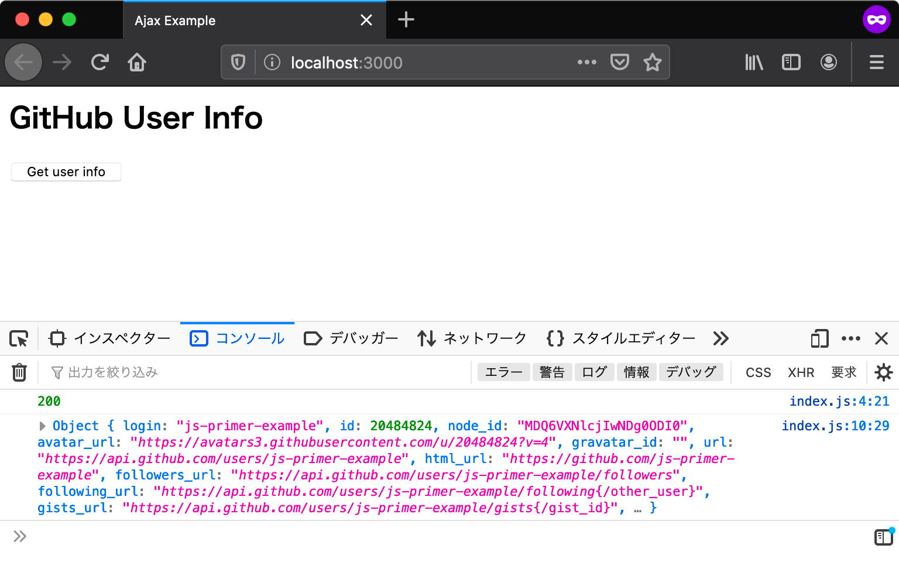

# HTTP通信 {#http-communication}

アプリケーションが実行できるようになったので、次はGitHubのAPIを呼び出す処理を実装していきます。
当然ですが、GitHubのAPIを呼び出すためにはHTTP通信をする必要があります。
ウェブブラウザ上でJavaScriptからHTTP通信するために、[Fetch API][]という機能を使います。

## Fetch API {#fetch-api}

**Fetch API**はHTTP通信を行いリソースを取得するためのAPIです
Fetch APIを使うことで、ページ全体を再読み込みすることなく指定したURLからデータを取得できます。
Fetch APIは同じくHTTP通信を扱う[XMLHttpRequest][]と似たAPIですが、より強力で柔軟な操作が可能です。

GitHubが提供している、ユーザー情報を取得するためのWebAPIを呼び出すコードは次のようになります。
リクエストを送信するためには、グローバルスコープの`fetch`メソッドを呼び出します。
`fetch`メソッドにURLを与えることで、HTTPリクエストが作成され、サーバーとのHTTP通信を開始します。


<!-- fetchがないため -->
<!-- doctest:disable -->
```js
fetch(`https://api.github.com/users/${userId}`);
```

## レスポンスの受け取り {#receive-response}

GitHubのAPIに対してHTTPリクエストを送信しましたが、まだレスポンスを受け取る処理を書いていません。
次はサーバーから返却されたレスポンスのログをコンソールに出力する処理を実装します。

`fetch`メソッドは`Promise`を返します。これはリクエストのレスポンスを表す`Response`オブジェクトでresolveされます。
送信したリクエストにレスポンスが返却されると、`then`コールバックが呼び出されます。
次のように、`Response`オブジェクトの`status`プロパティからはHTTPレスポンスのステータスコードが取得できます。
また、`json`メソッドも`Promise`を返します。これは HTTPレスポンスをJSONとしてパースしたオブジェクトでresolveされます。

<!-- fetchがないため -->
<!-- doctest:disable -->
```js
fetch(`https://api.github.com/users/${userId}`)
    .then(response => {
        console.log(response.status); // => 200
        response.json().then(userInfo => {
            // JSONパースされたオブジェクトが渡される
            console.log(userInfo); // => {...}
        });
    });
```

## エラーハンドリング {#error-handling}

HTTP通信にはエラーがつきものです。
そのためFetch APIを使った通信においても、エラーをハンドリングする必要があります。
サーバーとの通信に際してネットワークエラーが発生した場合は、ネットワークエラーを表す`NetworkError`オブジェクトでrejectされた`Promise`が返されます。
すなわち、`then`メソッドの第2引数か`catch`メソッドのコールバック関数が呼び出されます。

<!-- fetchがないため -->
<!-- doctest:disable -->
```js
fetch(`https://api.github.com/users/${userId}`)
    .then(response => {
        console.log(response.status);
        response.json().then(userInfo => {
            console.log(userInfo);
        });
    }).catch(error => {
        console.error("ネットワークエラー", error);
    });
```

一方で、リクエストが成功したかどうかは`Response`オブジェクトの`ok`プロパティで認識できます。
`ok`プロパティは、HTTPステータスコードが200番台であれば`true`を返し、400や500番台であれば`false`を返します。
次のように、`ok`プロパティが`false`であるサーバーエラーをハンドリングできます。

<!-- fetchがないため -->
<!-- doctest:disable -->
```js
fetch(`https://api.github.com/users/${userId}`)
    .then(response => {
        console.log(response.status); 
        // エラーレスポンスが返されたことを検知する
        if (!response.ok) {
            console.error("サーバーエラー", response);
        } else {
            response.json().then(userInfo => {
                console.log(userInfo);
            });
        }
    }).catch(error => {
        console.error("ネットワークエラー", error);
    });
```

ここまでの内容をまとめ、GitHubからユーザー情報を取得する関数を`getUserInfo`という名前で定義します。

[import, index.js](src/index.js)

index.jsでは関数を定義しているだけで、呼び出しは行っていません。
ページを読み込むたびにGitHubのAPIを呼び出すと、呼び出し回数の制限を超えるおそれがあります。
呼び出し回数の制限を超えると、APIからのレスポンスがステータスコード403のサーバーエラーになってしまいます。
そこで`getUserInfo`関数を呼び出すため、HTMLドキュメント側にボタンを追加します。
ボタンのclickイベントで`getUserInfo`関数を呼び出し、固定のユーザーIDを引数として与えています。

[import, index.html](src/index.html)

準備ができたら、ローカルサーバーを立ち上げてindex.htmlにアクセスしましょう。
ボタンを押すとHTTP通信が行われ、コンソールにステータスコードとレスポンスのログが出力されます。



また、開発者ツールのネットワーク画面を開くと、確かにGitHubのサーバーに対してHTTP通信が行われていることを確認できます。


## [コラム] XMLHttpRequest {#xhr}

[XMLHttpRequest][]（**XHR**）はFetch APIと同じくHTTP通信を行うためのAPIです。
Fetch APIが標準化される以前は、ブラウザとサーバーの間で通信を行うにはXHRを使うのが一般的でした。
このセクションで扱ったFetch APIによる`getUserInfo`関数は、XHRを使うと次のようになります。

<!-- doctest:async:16 -->
```js
function getUserInfo(userId) {
    // リクエストを作成する
    const request = new XMLHttpRequest();
    request.open("GET", `https://api.github.com/users/${userId}`);
    request.addEventListener("load", () => {
        // ステータス4XXと5XXをサーバーエラーとする
        if (request.status >= 400 || request.status <= 599) {
            console.error("サーバーエラー", request.responseText);
        } else {
            // レスポンス文字列をJSONオブジェクトにパースする
            const userInfo = JSON.parse(request.responseText);
            console.log(userInfo);
        }
    });
    request.addEventListener("error", () => {
        console.error("ネットワークエラー");
    });
    // リクエストを送信する
    request.send();
}
```

Fetch APIはXHRを置き換えるために作られたもので、多くのユースケースではXHRを使う必要はなくなっています。
ただし、Fetch APIはまだ標準化できていない機能もあり、次のようなケースをサポートしているのはXHRだけです。

* 送信したリクエストを中断する（[XMLHttpRequest#abort][]）
* リクエスト中の[プログレスイベント][]を受け取る（）

XHRの詳しい使い方については、[XHRの利用についてのドキュメント][]を参照してください。


[Fetch API]: https://developer.mozilla.org/ja/docs/Web/API/Fetch_API
[XMLHttpRequest]: https://developer.mozilla.org/ja/docs/Web/API/XMLHttpRequest
[XMLHttpRequest#abort]: https://developer.mozilla.org/ja/docs/Web/API/XMLHttpRequest/abort
[プログレスイベント]: https://developer.mozilla.org/ja/docs/Web/API/ProgressEvent
[XHRの利用についてのドキュメント]: https://developer.mozilla.org/ja/docs/Web/API/XMLHttpRequest/Using_XMLHttpRequest
