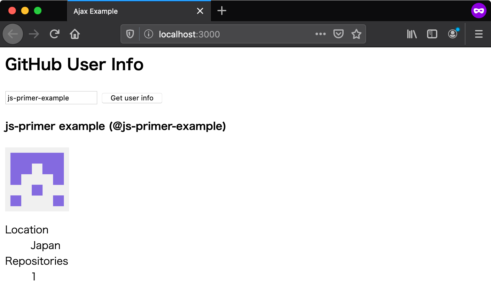

# Promiseを活用する {#use-promise}

ここまでのセクションで、Fetch APIを使ってAjax通信を行い、サーバーから取得したデータを表示できました。
最後に、Fetch APIの戻り値でもある**Promise**を活用してソースコードを整理することで、エラーハンドリングをしっかり行います。

## 関数の分割 {#split-function}

まずは、大きくなりすぎた`getUserInfo`関数を整理しましょう。
この関数では、Fetch APIを使ったデータの取得・HTML文字列の組み立て・組み立てたHTMLの表示をしています。
そこで、HTML文字列を組み立てる`createView`関数とHTMLを表示する`displayView`関数を作り、処理を分割します。

また、後述するエラーハンドリングを行いやすくするため、アプリケーションにエントリポイントを設けます。
index.jsに新しく`main`関数を作り、その中で`getUserInfo`関数を呼び出すようにします。

<!-- doctest:async:16 -->
```js
function main() {
    getUserInfo("js-primer-example");
}

function getUserInfo(userId) {
    fetch(`https://api.github.com/users/${userId}`)
        .then(response => {
            if (!response.ok) {
                console.error("サーバーエラー", response);
            } else {
                return response.json().then(userInfo => {
                    // HTMLの組み立て
                    const view = createView(userInfo);
                    // HTMLの挿入
                    displayView(view);
                });
            }
        }).catch(error => {
            console.error("ネットワークエラー", error);
        });
}

function createView(userInfo) {
    return escapeHTML`
    <h4>${userInfo.name} (@${userInfo.login})</h4>
    
    <dl>
        <dt>Location</dt>
        <dd>${userInfo.location}</dd>
        <dt>Repositories</dt>
        <dd>${userInfo.public_repos}</dd>
    </dl>
    `;
}

function displayView(view) {
    const result = document.getElementById("result");
    result.innerHTML = view;
}
```

ボタンのclickイベントで呼び出す関数もこれまでの`getUserInfo`関数から`main`関数に変更します。

```html
<html lang="ja">
  <head>
    <meta charset="utf-8" />
    <title>Ajax Example</title>
  </head>
  <body>
    <h2>GitHub User Info</h2>
    <button onclick="main();">Get user info</button>
    <div id="result"></div>
    <script src="index.js"></script>
  </body>
</html>
```

## Promiseのエラーハンドリング {#error-handling}

`getUserInfo`関数を変更し、Fetch APIの戻り値でもあるPromiseオブジェクトをreturnします。
この変更によってそれを呼び出す`main`関数の方で非同期処理の結果を扱えるようになります。
Promiseチェーンの中で投げられたエラーは、`Promise#catch`メソッドを使って一箇所で受け取れます。

次のコードでは、`getUserInfo`関数から返されたPromiseオブジェクトを、`main`関数でエラーハンドリングしてログを出力します。
`getUserInfo`関数ではネットワークエラーとサーバーエラーを投げています。
投げられたエラーは`catch`のコールバック関数で第1引数として受け取れます。

<!-- doctest:async:16 -->
```js
function main() {
    getUserInfo("js-primer-example")
        .catch((error) => {
            // Promiseのコンテキスト内で発生したエラーを受け取る
            console.error(`エラーが発生しました (${error})`);
        });
}

function getUserInfo(userId) {
    // fetchの戻り値のPromiseをreturnする
    return fetch(`https://api.github.com/users/${userId}`)
        .then(response => {
            if (!response.ok) {
                // サーバーエラーを投げる
                throw new Error(`${event.target.status}: ${event.target.statusText}`);
            } else {
                return response.json().then(userInfo => {
                    // HTMLの組み立て
                    const view = createView(userInfo);
                    // HTMLの挿入
                    displayView(view);
                });
            }
        }).catch(error => {
            // ネットワークエラーを投げる
            throw new Error("ネットワークエラー");
        });
}
```

### Promiseチェーンのリファクタリング {#refactor-promise-chain}

`Promise#then`メソッドでつながるPromiseチェーンは、`then`に渡されたコールバック関数の戻り値をそのまま次の`then`へ渡します。
ただし、コールバック関数の戻り値がPromiseである場合は、そのPromiseで解決された値を次の`then`に渡します。
つまり、`then`のコールバック関数が同期処理から非同期処理に変わったとしても、次の`then`が受け取る値の型は変わらないということです。

Promiseチェーンを使って処理を分割する利点は、同期処理と非同期処理を区別せずに連鎖できることです。
一般に、同期的に書かれた処理を後から非同期処理へと変更することは、全体を書き換える必要があるため難しいです。
そのため、最初から処理を分けておき、処理を`then`を使って繋ぐことで、変更に強いコードを書くことができます。
どのように処理を区切るかは、それぞれの関数が受け取る値の型と、返す値の型に注目するのがよいでしょう。
Promiseチェーンで処理を分けることで、それぞれの処理が簡潔になりコードの見通しがよくなります。

さて、今の`getUserInfo`関数ではFetch APIが返したPromiseの`then`でHTMLの組み立てと表示も行っています。
このPromiseチェーンを次のように書き換えてみましょう。
`getUserInfo`関数では、Fetch APIが返すPromiseの`then`メソッドで、`Reponse#json`メソッドの戻り値を返しています。
`Reponse#json`メソッドの戻り値はJSONオブジェクトで解決されるPromiseなので、次の`then`ではユーザー情報のJSONオブジェクトが渡されます。
同じように、`userInfo`を受け取った関数は`createView`関数を呼び出し、その戻り値を次の`then`に渡しています。

<!-- doctest:async:16 -->
```js
function main() {
    getUserInfo("js-primer-example")
        // ここではJSONオブジェクトで解決されるPromise
        .then((userInfo) => createView(userInfo))
        // ここではHTML文字列で解決されるPromise
        .then((view) => displayView(view))
        .catch((error) => {
            console.error(`エラーが発生しました (${error})`);
        });
}

function getUserInfo(userId) {
    return fetch(`https://api.github.com/users/${userId}`)
        .then(response => {
            if (!response.ok) {
                throw new Error(`${event.target.status}: ${event.target.statusText}`);
            } else {
                // userInfoを解決するPromiseを返す
                return response.json();
            }
        }).catch(error => {
            throw new Error("ネットワークエラー");
        });
}
```

### Async Functionへの置き換え {#rewrite-to-async-function}

Promiseチェーンによって、Promiseの非同期処理と同じ見た目で同期処理を記述できるようになりました。
一方でAsync Functionを使うと、同期処理と同じ見た目でPromiseの非同期処理を記述できるようになります。
Promiseの`then`メソッドによるコールバック関数の入れ子がなくなり、手続き的で可読性が高いコードになります。
また、エラーハンドリングも同期処理と同じくtry...catch文を使うことができます。

`main`関数を次のように書き換えましょう。まず関数宣言の前に`async`をつけてAsync Functionにしています。
次に`fetchUserInfo`関数の呼び出しに`await`をつけます。
これによりPromiseに解決されたJSONオブジェクトを`userInfo`変数に代入できます。

もし`fetchUserInfo`関数の中で例外が投げられた場合は、try...catch文でエラーハンドリングできます。
あらかじめ非同期処理の関数がPromiseを返すようにしておくと、Async Functionにリファクタリングしやすくなります。

<!-- doctest:async:16 -->
```js
async function main() {
    try {
        const userInfo = await fetchUserInfo("js-primer-example");
        const view = createView(userInfo);
        displayView(view);
    } catch (error) {
        console.error(`エラーが発生しました (${error})`);
    }
}
```

## ユーザーIDを変更できるようにする {#changeable-userid}

仕上げとして、今まで`js-primer-example`で固定としていたユーザーIDを変更できるようにしましょう。
index.htmlに`<input>`タグを追加し、JavaScriptから値を取得するために`userId`というIDを付与しておきます。

[import, index.html](src/index.html)

index.jsにも`<input>`タグから値を受け取るための処理を追加すると、最終的に次のようになります。

[import, index.js](src/index.js)

アプリケーションを実行すると、次のようになります。
要件を満たすことができたので、このアプリケーションはこれで完成です。



[Promiseチェーン]: https://developer.mozilla.org/ja/docs/Web/JavaScript/Reference/Global_Objects/Promise/then#%E3%83%81%E3%82%A7%E3%83%BC%E3%83%B3
