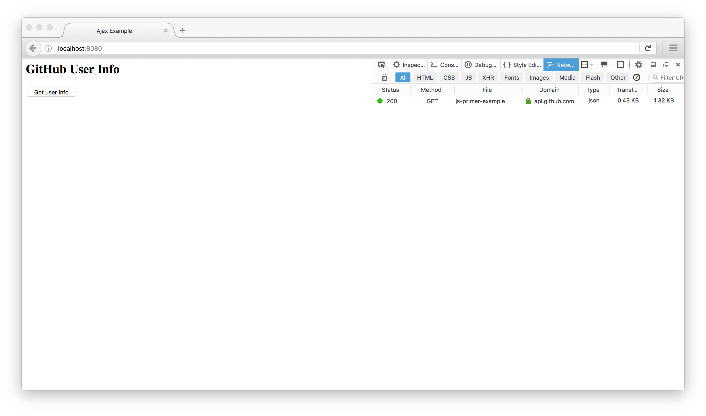

# HTTP通信 {#http-communication}

アプリケーションが実行できるようになったので、次はGitHubのAPIを呼び出す処理を実装していきます。
当然ですが、GitHubのAPIを呼び出すためにはHTTP通信を行う必要があります。
ウェブブラウザ上でJavaScriptからHTTP通信を行うには`XMLHttpRequest`という機能を使います。

## `XMLHttpRequest` {#xml-http-request}

`XMLHttpRequest`（**XHR**）はクライアントとサーバー間でデータをやり取りするためのAPIです。
XHRを使うことで、ページ全体を再読み込みすることなくURLからデータを取得できます。

GitHubが提供している、ユーザー情報を取得するためのWebAPIを呼び出すコードは次のようになります。
リクエストを送信するためには、まず`XMLHttpRequest`クラスのインスタンスを作ります。
作成したXHRのインスタンスに、リクエストメソッドとURLを与えることで、HTTPリクエストが組み立てられます。
URLをテンプレート文字列にしているのは、変数でユーザーIDを設定するためです。
URLをオープンして組み立てられたXHRは、最後に`send`することでサーバーとの通信を開始します。

<!-- XHRがないため -->
<!-- doctest:disable -->
```js
const request = new XMLHttpRequest();
request.open("GET", `https://api.github.com/users/${userId}`);
request.send();
```

このように、XHRを使ったHTTP通信は基本的に3ステップで行われます。

1. XHRのインスタンスを生成（`new XMLHttpRequest`）
2. リクエストを初期化（`request.open`メソッド）
3. リクエストを送信（`request.send`メソッド）

## レスポンスの受け取り {#receive-response}

GitHubのAPIに対してHTTPリクエストを送信しましたが、まだレスポンスを受け取る処理を書いていません。
次はサーバーから返却されたレスポンスのログをコンソールに出力する処理を実装します。

非同期的なXHRの場合、レスポンスはXHRが発火するイベントのコールバック内で受け取れます。
実はXHRにはHTTP通信を同期的に実行するモードも存在しますが、一般的にはXHRを同期的に行うことはありません。
なぜならWebブラウザ上で実行されるJavaScriptはシングルスレッドであり、
HTTP通信を行っている間はすべての処理がブロックされてしまうからです。
そもそも本章のテーマでもある**AJAX**の根幹はAsynchronous（非同期的）であることなので、
ここで登場するXHRはすべて非同期的とします。

送信したXHRにHTTPレスポンスが返却されると、`load`イベントが発生します。
XHRインスタンスの`addEventListener`メソッドにイベント名とコールバック関数を渡すことで、指定したイベントを受け取れます。
コールバック関数の第１引数には `Event`オブジェクトが渡されます。
このオブジェクトの`target`プロパティには、[イベントを発生させたオブジェクト][]（[EventTarget][]）である
XHRのインスタンスがセットされています。
XHRの`responseText`プロパティからは、HTTPレスポンスが文字列で取得できます。
また、`status`プロパティからはHTTPレスポンスのステータスコードが取得できます。

<!-- XHRがないため -->
<!-- doctest:disable -->
```js
const request = new XMLHttpRequest();
request.open("GET", `https://api.github.com/users/${userId}`);
request.addEventListener("load", (event) => {
    console.log(event.target.status); // => 200
    console.log(event.target.responseText); // => "{...}"
});
request.send();
```

HTTPレスポンスの内容によらず、`responseText`は常に文字列としてレスポンスを読み取れます。
一方、XHRには`response`というプロパティもあります。
リクエストを送るときに`responseType`を指定しておくと、その型にしたがって変換されたオブジェクトが`response`から取得できます。
`response`プロパティは便利なAPIなのですが、サーバー側の実装やブラウザの実装などに依存するため、本章では扱いません。
興味があれば、詳細については[XMLHttpRequest.response][]を参照してください。

## エラーハンドリング {#error-handling}

HTTP通信にはエラーがつきものです。
もちろんXHRを使った通信においても、エラーをハンドリングする方法があります。
XHRではレスポンスの受け取りと同じように、イベントリスナによってエラーのハンドリングが可能です。
サーバーとの通信に際してエラーが発生した場合は、`error`イベントが発生されます。

<!-- XHRがないため -->
<!-- doctest:disable -->
```js
request.addEventListener("error", () => {
    console.log("Network Error!");
});
```

注意すべき点は、サーバーがレスポンスとして返却するエラーは、通常のレスポンスと同様に`load`イベントで受け取ることです。
たとえば、ステータスコードが200以外である場合のハンドリングは次のように行います。

<!-- XHRがないため -->
<!-- doctest:disable -->
```js
request.addEventListener("load", (event) => {
    if (event.target.status !== 200) {
        console.log(`Error: ${event.target.status}`);
        return;
    }
});
```

ここまでの内容をまとめ、GitHubからユーザー情報を取得するの関数を`getUserInfo`という名前で定義します。

[import, index.js](src/index.js)

index.jsでは関数を定義しているだけで、呼び出しは行っていません。
ページを読み込むたびにGitHubのAPIを呼び出してしまうと、呼び出し回数の制限を超えるてしまうおそれがあります。
そこで`getUserInfo`関数を呼び出すため、HTMLドキュメント側にボタンを追加します。
ボタンのclickイベントで`getUserInfo`関数を呼び出し、固定のユーザーIDを引数として与えています。

[import, index.html](src/index.html)

準備ができたら、ローカルサーバーを立ち上げてindex.htmlにアクセスしましょう。
ボタンを押すとHTTP通信が行われ、コンソールにステータスコードとレスポンスのログが出力されます。


また、開発者ツールのネットワーク画面を開くと、確かにGitHubのサーバーに対してHTTP通信が行われていることを確認できます。



[イベントを発生させたオブジェクト]: https://developer.mozilla.org/ja/docs/Web/API/Event/target
[EventTarget]: https://dom.spec.whatwg.org/#eventtarget
[XMLHttpRequest.response]: https://developer.mozilla.org/en-US/docs/Web/API/XMLHttpRequest/response
