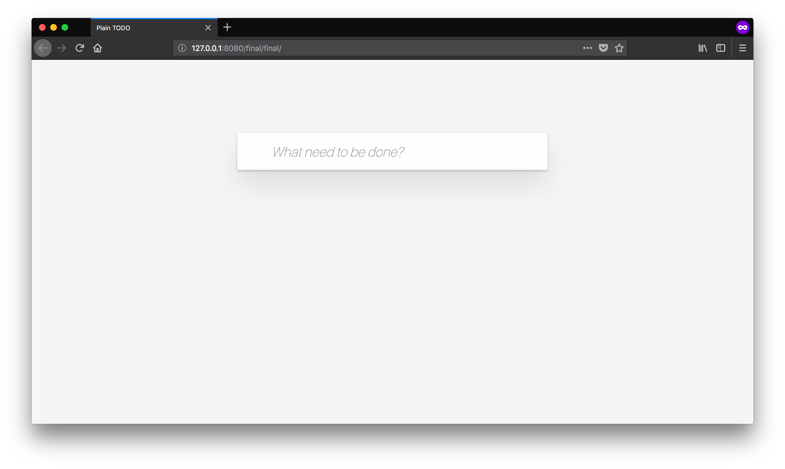

# アプリの構成要素 {#app-structure}

HTMLとJavaScriptの[エントリポイント][]を作成しましたが、次はこのTodoアプリの構成要素をあらためて見ていきましょう。

Todoアプリは、次のような機能を実装していきます。
Todoアイテムの追加、更新、削除、現在の状態の表示など複数の機能を持っています。

- Todoアイテムを追加する
- Todoアイテムを更新する
- Todoアイテムを削除する
- Todoアイテム数（合計）の表示

また、アプリと呼ぶからには見た目もちょっとしたものにしないと雰囲気が出ません。
このセクションでは、まずウェブアプリケーションを構成するHTML、CSS、JavaScriptの役割について見ていきます。
このセクションで見た目だけで機能がないハリボテのTodoアプリを完成させ、次のセクションから実際にJavaScriptを使ってTodoアプリの機能を実装していきます。

## HTMLとCSSとJavaScript {#html-css-javascript}

Todoアプリはブラウザで動くアプリケーションとして作成しますが、ウェブアプリを作成するにはHTMLやCSS、JavaScriptを組み合わせて書いていきます。
今回はHTTP通信などはいらないクライアントサイドのみで解決するウェブアプリなので、サーバーサイドの言語は登場しません。

- HTML: コンテンツの構造を記述するためのマークアップ言語
- CSS: HTMLの見た目を装飾するスタイルシート言語
- JavaScript: インタラクションといった動作を扱うプログラミング言語

多くのウェブアプリケーションはHTMLでコンテンツの構造を定義し、CSSで見た目を装飾し、JavaScriptで動作を付けることで実装されます。
そのため、ウェブアプリはHTML、CSS、JavaScriptを組み合わせて作られています。

一方、ブラウザにはiOSやAndroidのようにOSが提供するようなUIフレームワークの標準はありません。
また、ユーザーが実装したさまざまな種類のUIフレームワークがあります。
そのため、Todoアプリという題材をとってみても、フレームワークや人によって書き方が全く異なる場合もあります。

今回のTodoアプリは特別なUIフレームワークを使わずに、そのままのHTML、CSS、JavaScriptを組み合わせて書いていきます。

## Todoアプリの構造をHTMLで定義する {#todo-html}

最初に今回作成するTodoアプリのHTMLの構造を定義しています。
ここで定義したHTMLとCSSは最後までこの形のまま利用します。
次のセクションから変更していくのはJavaScriptだけということになります。

「[エントリポイント][]」のセクションで作成した`todoapp`ディレクトリの`index.html`を次の内容に変更します。

[import, title:"index.html"](./todo-html/index.html)

HTMLの内容を変更後にブラウザでアクセスすると次のような表示になります。
まだJavaScriptでTodoアプリの機能は実装していませんが、見た目だけのTodoアプリはこれで完成です。



実際に変更したHTMLを上から順番に見てみましょう。

### 1. CSSファイルを読み込み {#comment-css-file-load}

`head`要素の中で`link`タグを使い、外部のCSSファイルを読み込んでいます。
今回読み込んでいるCSSファイルには、Todoアプリらしい表示に必要なCSSを定義したファイルになっています。

- <https://jsprimer.net/use-case/todoapp/final/final/index.css>

このCSSは動作には影響がないため、今回のユースケースでは外部ファイルをそのまま取り込むだけにし解説は省略します。
CSSに定義したスタイルを正しく適応するには、`class`属性やHTML要素の構造が一致している必要があります。
表示が崩れている場合は、`class`属性が正しいかやHTMLの構造が同じになっているかを確認して見てください。

### 2. class属性をCSSのために指定 {#comment-class-for-css}

`div`タグの`class`属性に`todoapp`という値（クラス名）を設定しています。
`class`属性は基本的にはCSSから装飾するための目印として利用されます。
また、ひとつのページの中で同じクラス名は複数の要素に対して設定できます。
HTMLの`class`属性はJavaScriptの`class`構文とは無関係なことには注意が必要です。

今回の`todoapp`というクラス名をもつ要素を、CSSから`.todoapp`というCSSセレクタで指定できます。
[CSSセレクタ][]とはクラス名などを使い、HTML要素を指定できる記法です。
特定の「クラス名」をもつ要素の場合は`.クラス名`（クラス名の前にドット）で選択できます。

次のCSSコードでは、`todoapp`というクラス名をもつ要素の`background`プロパティの値を`black`にしています。
つまり`todoapp`クラス名の要素の背景色を黒色にするという意味になります。

```css
.todoapp {
    background: black;
}
```

CSSセレクタではタグ名、`id`属性や構造などに対する指定もできます。
たとえば、特定の「id名」をもつ要素の場合は`#id名`で選択できます。

```css
#id名 {
  /* CSSプロパティで装飾する */
}
```

### 3. id属性をJavaScriptのために指定 {#comment-id-for-js}

`id`属性はその要素に対するページ内でユニークな識別子を付けるための属性です。
`id`属性はCSS、JavaScript、リンクのアンカーなどさまざまな用途で利用されます。
またひとつのページの中で同じid属性名を複数の要素に対しては設定できません。

今回のTodoアプリではJavaScriptから要素を選択するために`id`属性を設定しています。
先ほどのCSSセレクタはCSSから要素を指定するだけではなく、JavaScriptから要素を指定する際にも利用できます。
ブラウザのDOM APIの`document.querySelector` APIではCSSセレクタを使い要素を選択できます。

次のコードでは、`document.querySelector("CSSセレクタ")`を利用し、特定のid属性名の要素を取得しています。

<!-- doctest:disable -->
```js
// id属性の値が"js-form"である要素を取得する
const form = document.querySelector("#js-form");
```

そのため、JavaScriptで参照する要素には`id`属性を目印として付けています。
それぞれの属性に`js-`というプリフィックスがついていることからも分かるように、JavaScriptから扱う部分には`js-`から始まる名前にしています。
`id`属性は同じページに1つしか存在できないため、この`id`属性はJavaScriptのために付けているということを分かりやすくするための慣習です。

### 4. TodoアプリのメインとなるTodoリスト {#comment-todo-list}

`js-todo-list`という`id`属性を付けた`div`要素が今回のTodoアプリのメインとなるTodoリストです。
この`div`要素の中身はJavaScriptで動的に更新されるため、HTMLでは目印となる`id`属性をつけています。

初期表示時はTodoリストの中身がまだ空であるため、何も表示されていません。
また`<!--`と`-->`で囲まれた範囲はHTMLコメントであるため、表示されません。

### 5. Todoアイテム数の表示 {#comment-todo-count}

`js-todo-count`という`id`属性を付けた`span`要素は、現在のTodoリストのアイテム数を表示します。
初期表示時はTodoリストが空であるため0個となりますが、Todoアイテムを追加や削除する際には合わせて更新する必要があります。

## まとめ {#conclusion}

このセクションではHTMLでアプリの構造を定義し、CSSでアプリのスタイルを定義しました。
次のセクションではJavaScriptモジュールを作成していき、現在は空であるTodoリストを更新していきます。

## このセクションのチェックリスト {#section-checklist}

- 実装するTodoアプリの構成要素を理解した
- HTML、CSS、JavaScriptの役割の違いを理解した
- Todoアプリの見た目をHTMLとCSSで定義した

ここまでのTodoアプリは次のURLで確認できます。

- <https://jsprimer.net/use-case/todoapp/app-structure/todo-html/>

[エントリポイント]: ../entrypoint/README.md
[CSSセレクタ]: https://developer.mozilla.org/ja/docs/Learn/CSS/Introduction_to_CSS/Selectors
