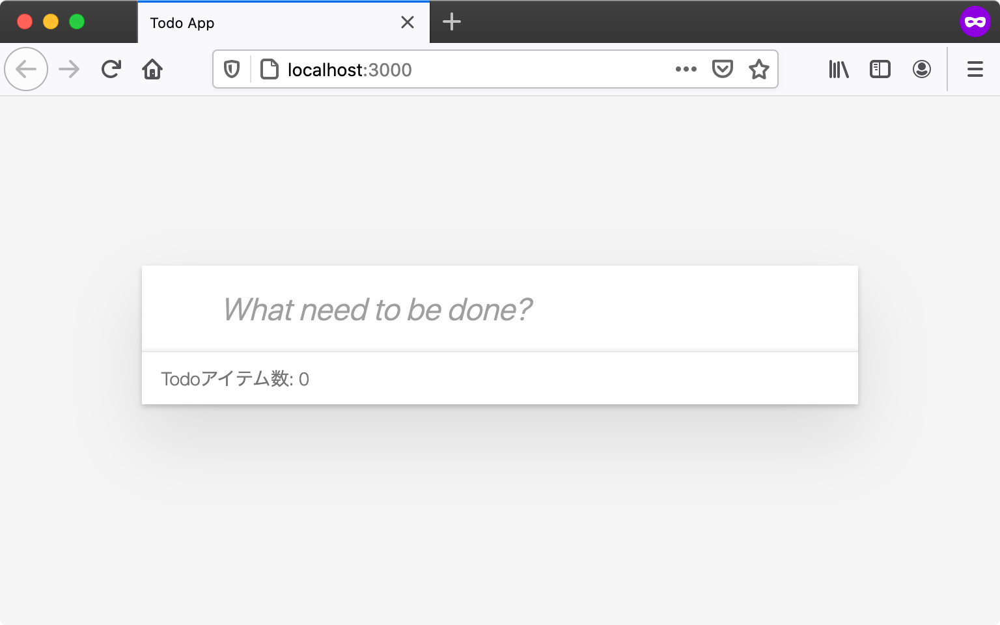

# アプリの構成要素 {#app-structure}

HTMLとJavaScriptの[エントリポイント][]を作成しましたが、次のはこのTodoアプリの構成要素をあらためて見ていきましょう。
Todoアプリは、次のような機能を実装していくため複数の機能を実装していく必要があります。

- Todoを追加する
- Todoを更新する
- Todoを削除する

また、アプリと呼ぶからには見た目もちょっとしたものにしないと雰囲気が出ません。
このセクションでは、多くのウェブアプリケーションを構成するHTML、CSS、JavaScriptの役割について見ていきます。
このセクションで見た目だけで機能がないハリボテのTodoアプリは完成させ、次のセクションから実際にJavaScriptを使ってTodoアプリを実装していきます。

## ユーザー・インタフェース {#ui}

Todoアプリはブラウザで実行する向けに書いていきますが、ウェブアプリを作成するにはHTMLやCSS、JavaScriptを組み合わせて書いていきます。

- HTML: コンテンツの構造を記述するためのマークアップ言語
- CSS: HTMLの見た目を装飾するスタイルシート言語
- JavaScript: インタラクションといった動作を扱うプログラミング言語

多くのウェブアプリケーションはHTMLでコンテンツの構造を定義し、CSSで見た目を装飾し、JavaScriptで動作を付けることで実装されます。
JavaScriptは動的にHTMLやCSSを定義できるため、役割が明確に見えない場合もありますがこれらを組み合わせていることには代わりません。

一方、ブラウザにはiOSやAndroidのようにOSが提供するようなUIフレームワークの標準はありません。
そのためユーザーの実装したさまざまなUIフレームワークがあります。
それらのフレームワークを使うかや自分でアプリごとに定義してユーザーインターフェースを作成します。
これは１つのTodoアプリをとっても書き方が人によって全く異なる場合があるということでもあります。

今回のTodoアプリは特別なフレームワークを使わずに、そのままのHTML、CSS、JavaScriptを組み合わせて書いていきます。

## Todoアプリの構造をHTMLで定義する {#todo-html}

最初に今回作成するTodoアプリのHTMLの構造を定義しています。
ここで定義したHTMLとCSSは最後までこの形のまま利用します。

[エントリポイント][]のセクションで作成した`todoapp`ディレクトリの`index.html`を次の内容に変更します。

[import, todo-html/index.html](./todo-html/index.html)

HTMLの内容を変更後にブラウザでアクセスすると次のような表示になります。
この段階では動作となるJavaScriptは定義していませんが、見た目だけのTodoアプリはこれで完成です。



実際に変更したHTMLを上から順番に見てみましょう。

### 1. CSSファイルを読み込み {#comment-css-file-load}

`head`要素の中で`link`タグを使い、外部のCSSファイルを読み込んでいます。
今回読み込んでいるCSSファイルには、Todoアプリらしい表示に必要なCSSを定義したファイルになっています。

- <https://asciidwango.github.io/js-primer/use-case/todoapp/final/final/index.css>

このCSSは動作には影響がないため、今回のユースケースでは外部ファイルをそのまま取り込むだけにし解説は省略します。
CSSに定義したスタイルを正しく適応するには、`class`属性やHTML要素の構造が一致している必要があります。
表示が崩れている場合は、`class`属性が正しいかやHTMLの構造が同じになっているかを確認して見てください。

### 2. class属性をCSSのために指定 {#comment-class-for-css}

`div`タグの`class`属性に`todoapp`という値（クラス名）を設定しています。（JavaScriptの`class`構文とは無関係です）
`class`属性は基本的にはCSSから装飾するための目印として利用されます。
また、1ページの中で同じクラス名は複数の要素に対して設定できます。

今回の`todoapp`というクラス名をもつ要素を、CSSから`.todoapp`というCSSセレクタで指定できます。
[CSSセレクタ][]とは要素を指定するために利用される小さな言語のようなものです。
今回の特定の「クラス名」をもつ要素の場合は`.クラス名`（クラス名の前にドット）で選択できます。

次のCSSコードでは、`todoapp`というクラス名をもつ要素の`background`プロパティの値を`black`にしています。
つまり`todoapp`クラス名の要素の背景色を黒色にするという装飾をするということです。

```css
.todoapp {
    background: black;
}
```

CSSセレクタではタグ名、`id`属性や構造などに対する指定もできます。
たとえば、特定の「id名」をもつ要素の場合は`#id名`で選択できます。

```css
#id名 {
  /* CSSプロパティで装飾する */
}
```

### 3. id属性をJavaScriptのために指定 {#comment-id-for-js}

`id`属性はその要素に対するユニークな識別子を付けるための属性です。
`id`属性はCSS、JavaScript、リンクのアンカーなどさまざまな用途で利用されます。
また1ページの中で同じid属性名を複数の要素に対して設定できません。

先ほどのCSSセレクタはCSSから要素を指定するだけではなく、JavaScriptから要素を指定する際にも利用できます。
ブラウザのDOM APIの`document.querySelector` APIではCSSセレクタを使い要素を選択できます。

次のコードでは、`document.querySelector(CSSセレクタ)`を利用し、特定のid属性名の要素を取得しています。

```js
// id属性の値が"js-form"である要素を取得する
const form = document.querySelector("#js-form");
```

後からJavaScriptで利用する要素には`id`属性を目印として付けています。
それぞれの属性に`js-` というプロフィックスをついていることからも分かるように、JavaScriptから扱う部分には`js-`から始まる名前にしています。
`id`属性は同じページに1つしか存在できないため、この`id`属性はJavaScriptのために付けているということを分かりやすくするための慣習です。

### 4. TodoアプリのメインとなるTodoリスト {#comment-todo-list}

`js-todo-list`という`id`属性を付けた`div`要素が今回のTodoアプリのメインとなるTodoリストです。
この`div`要素の中身はJavaScriptで動的に更新されるため、HTMLでは目印となる`id`属性をつけています。

初期表示時はTodoリストの中身がまだ空であるため、何も表示されていません。（HTMLコメントは見た目には表示されません）

## まとめ {#conclusion}

このセクションではHTMLでアプリの構造を定義し、CSSでアプリのスタイルを定義しました。
次のセクションではJavaScriptモジュールを作成していき、現在は空であるTodoリストを更新していきます。

現在のTodoアプリのディレクトリ構造は次のようになります。

```
todoapp
├── index.html(今回の変更点)
├── index.js
├── node_modules
├── package.json
└── src
    └── App.js
```

現在のTodoアプリは次のURLで実際に確認できます。

- <https://asciidwango.github.io/js-primer/use-case/todoapp/app-structure/todo-html/>

[エントリポイント]: ../entrypoint/README.md
[CSSセレクタ]: https://developer.mozilla.org/ja/docs/Learn/CSS/Introduction_to_CSS/Selectors
