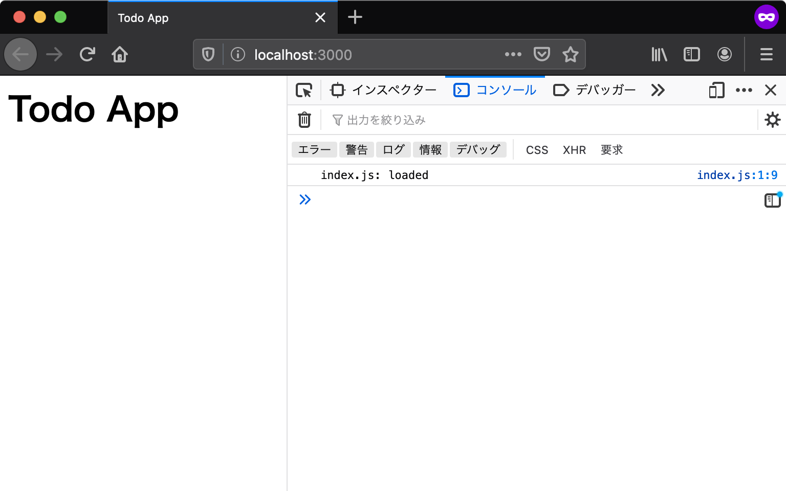

# エントリポイント {#entrypoint}

エントリポイントとは、アプリケーションの中で一番最初に呼び出される部分のことです。

[Ajax通信:エントリポイント][]のユースケースでは、エントリポイントはHTML（`index.html`)のみでした。
まずHTMLが読み込まれ、次にHTMLの中に書かれているJavaScriptファイルが読み込まれます。

今回のTodoアプリは処理をモジュール化し、それぞれのモジュールを別々のJavaScriptファイルとして作成していきます。
JavaScriptモジュールはHTMLから`<script type="module">`で読み込むことができますが、`script`タグ毎に別々のモジュールスコープを持ちます。
そのため、JavaScriptモジュールを別々の`script`タグで読み込むとモジュール同士でスコープが異なるため、モジュール同士で連携できません。

次のコードは、それぞれの`<script type="module">`同士のスコープが異なるため、別の`script`タグで定義した変数にアクセス出来ないことを示しています。これはJavaScriptのコードをファイルにして`src`属性で読み込んだ場合も同様です。

[import:"marker"](./module-scope/index.html)

そのため、HTMLから読み込むのは1つのJavaScriptファイル(`index.js`)として、この`index.js`から他のモジュールを読み込み利用します。
このようにすることでモジュール間は1つの`<script type="module">`のスコープ内に収まるため、モジュール同士で連携できます。
このHTMLから読み込むJavaScriptファイル（`index.js`）をJavaScriptにおけるエントリポイントとします。

つまり、今回作成するTodoアプリではエントリポイントとしてHTMLとJavaScriptの2つを用意します。

- `index.html`: もっとも最初に読み込まれるファイル、`index.js`を読み込む
- `index.js`: `index.html`から読み込れるファイル、JavaScript間においては最初に読み込まれる

このセクションでは、この2つのエントリポイントを作成し読み込むところまでを確認します。

## プロジェクトディレクトリを作成 {#project-directory}

<!-- ソースコードは first-entry/ -->

今回作成するアプリにはHTMLやCSS、JavaScriptなど複数のファイル必要となります。
そのため、まずそれらを配置するディレクトリを作成します。

任意の名前で問題ありませんが、ここでは`todoapp`という名前のディレクトリを作成します。

## HTMLファイルの用意 {#preparing-html}

エントリポイントとして、まずは最低限の要素だけを配置したHTMLファイルを作成しましょう。
エントリポイントとなるHTMLとして`index.html`を作成し、次のような内容にします。
`body`要素の一番下で`<script>`タグを使い読み込んでいる`index.js`が、今回のアプリケーションの処理を記述するJavaScriptファイルです。

[import, index.html](first-entry/index.html)

`index.js`には、スクリプトが正しく読み込まれたことを確認できるように、コンソールにログを出力する処理だけを書いておきます。

[import, src/index.js](first-entry/index.js)

次はこのHTMLをブラウザで開きコンソールにログが出力されることを確認していきます。

## ローカルサーバでHTMLを確認する {#local-server}

ウェブブラウザで`index.html`を開くために開発用のローカルサーバーを準備します。
ローカルサーバーを立ち上げずに直接HTMLファイルを開くこともできますが、その場合`file:///`から始まるURLになります。
`file`スキーマでは[Same Origin Policy][]により、JavaScriptモジュールを始め多くのAPIに制限がありアプリケーションは正しく動作しません。
本章はローカルサーバーを立ち上げた上で、`http`スキーマのURLでアクセスすることを前提としています。

コマンドラインで`todoapp`ディレクトリへ移動し、次のコマンドでローカルサーバを起動します。
`npx`コマンドを使い、この書籍用に作成された`@js-primer/local-server`というローカルサーバモジュールをダウンロードと同時に実行します。

<!-- TODO: npxの解説へのリンクを貼る -->

```shell-session
# todoapp/ディレクトリに移動する
$ cd todoapp/
# todoapp/をルートにしたローカルサーバを起動する
$ npx @js-primer/local-server

todoappのローカルサーバを起動しました。
次のURLをブラウザで開いてください。

  URL: http://localhost:3000

```

起動したローカルサーバのURL（`http://localhost:3000`）へブラウザでアクセスしてみましょう。
ブラウザには`index.html`の内容が表示され、開発者ツールのコンソールに`index.js: loaded`というログが出力されていることが確認できます。



----

### 開発者ツールでのコンソールログの確認方法 {#view-console-log-in-dev-tools}

Console APIで出力したログを確認するには、ウェブブラウザの開発者ツールを開く必要があります。
ほとんどのブラウザで開発者ツールが同梱されていますが、本章ではFirefoxを使って確認します。
開発者ツールの**コンソール**タブを開くとConsole APIで出力したログを確認できます。

Firefoxの開発者ツールは次のいずれかの方法で開きます。

- Firefox メニュー（メニューバーがある場合やmacOSでは、ツールメニュー）の Web 開発サブメニューで "Web コンソール" を選択する
- キーボードショートカット`Ctrl+Shift+K`（macOSでは`Command+Option+K`）を押下する

詳細は"[Webコンソールを開く][]"を参照してください。

### [エラー例] コンソールログが表示されない {#error-not-display-console-log}

HTMLは表示されるがコンソールログに`index.js: loaded`が表示されない場合は次のような問題であるかを確認して見てください。

- `index.js`の読み込みに失敗している
- JavaScriptモジュールに非対応のブラウザを利用している

> `index.js`の読み込みに失敗している

scirptタグに指定した`index.js`のパスにファイルが存在しているかを確認してください。
`<script type="module" src="index.js">`としてした場合は`index.html`と`index.js`は同じディレクトリに配置する必要があります。

また、 *CORS policy Invalid*のようなエラーがコンソールに表示されている場合は、[Same Origin Policy][]により`index.js`の読み込みが失敗しています。
先ほども書いたように、`file:`から始まるページ上からはJavaScriptモジュールを読み込めないブラウザもあります。
そのため、ローカルサーバを起動し、ローカルサーバ(`http:`から始まるURL)にアクセスしていることを確認してください。

> JavaScriptモジュールに非対応のブラウザを利用している

JavaScriptモジュールはまだ新しい機能であるため、バージョンが60以上のFirefoxが必要です。
そのため、バージョンが60未満のFirefoxでは、モジュールである`index.js`が読み込めないためログが出力されません。

今回のTodoアプリでは、ネイティブでJavaScriptモジュールに対応しているブラウザが必要です。
[Can I Use][]にてネイティブでJavaScriptモジュールに対応しているブラウザがまとめられています。
非対応のブラウザでもBundlerと呼ばれるツールを使うことで対応できますが、本章では省略します。

----

## モジュールのエントリポイントの作成 {#module-entry-point}

<!-- ソースコードは module-entry/ -->

最後にエントリポイントとなる`index.js`から別のJavaScriptファイルをモジュールとして読み込んで見ましょう。
このアプリではJavaScriptモジュールが複数登場するため`src/`というディレクトリを作り、`src/`の下にJavaScriptモジュールを書くことにします。
今回は`src/App.js`にファイルを作成し、これを`index.js`からモジュールとして読み込みます。

最終的に現在の`todoapp`ディレクトリは次のような構造になります。

```
todoapp
├── index.html
├── index.js
├── node_modules
├── package.json
└── src
    └── App.js
```


`src/App.js`にファイルを作成し、次のような内容のJavaScriptモジュールとします。
モジュールは、基本的には何かしらを外部に公開(`export`）します。
`App.js`は`App`というクラスを公開するモジュールとして、今回はコンソールログを出力するだけです。

[import, src/App.js](module-entry/src/App.js)

次に、この`src/App.js`を`index.js`から取り込み(`import`)します。
`index.js`を次のように書き換え、`App.js`から`App`クラスを取り込みインスタンス化します。

[import, index.js](module-entry/index.js)

再度ローカルサーバのURL（`http://127.0.0.1:3030`）にブラウザでアクセスし、リロードしてみましょう。
コンソールログには、次のように処理の順番どおりのログが出力されます。

```
App.js: loaded
App initialized
```

まず`index.js`から`src/App.js`の`App`クラスが取り込まれています。
次に`App`クラスがインスタンス化されていることがログから確認できます。

これでHTMLとJavaScriptそれぞれのエントリポイントの作成と動作を確認できました。

### [エラー例] App.jsの読み込みに失敗する {#error-import-app-js}

ディレクトリ構造や`import`宣言で指定したファイルパスが異なると、ファイルを読み込むことができずにエラーとなってしまいます。
この場合は開発者ツールを開き、コンソールにエラーが出ていないかを確認して見てください。

`import`宣言を使ったJavaScriptモジュール読み込むで起きる典型的なエラーと対処を次にまとめています。

> SyntaxError: import declarations may only appear at top level of a module

「`import`宣言はモジュールのトップレベルでしか利用できません」というエラーがでています。
このエラーがでているということは、`import`宣言を使える条件を満たしていないということです。
つまり、`import`宣言がトップレベルではない所に書かれている、またはモジュールではない実行コンテキストで実行されているということです。

`import`宣言がトップレベルではない所に書かれているというのは、関数の中などに`import`宣言を行っています。
この場合は`import`宣言をトップレベル（ファイルの直下）に移動させてみてください。

モジュールではない実行コンテキストで実行されているというのは、裏を返せば実行コンテキストがScriptとなっているということです。
JavaScriptには実行コンテキストとしてScriptとModuleがあります。
`import`宣言は実行コンテキストがModuleでないと利用できません。
そのため、scriptタグの`type`指定を忘れていないかをチェックしてみてください。

実行コンテキストをモジュールとして実行するには`<script type="module" src="index.js">`のように`type=module`を指定する必要があります。
（`index.js`から`import`宣言で読み込んだ`App.js`は実行コンテキストを引き継ぐため、モジュールの実行コンテキストで処理されます。）

> モジュールのソース “http://localhost:3000/src/App” の読み込みに失敗しました。

`App.js`が読み込めていないというエラーがでています。
エラーメッセージをよく見ると`App`となっていて`App.js`ではありません。

`import`宣言では、読み込むファイルの拡張子を省略しません。
そのため、`App`のように拡張子（`.js`）を省略して書いている場合はこのエラーが発生します。

<!-- doctest:disable -->
```js
// エラーとなる例
import { App } from "./src/App";
```

正しくは次のように拡張子まで含めたパスを記述します。
また指定したパス（`./src/App.js`）にファイルが存在するかを確認してください。

<!-- doctest:disable -->
```js
// 正しい例
import { App } from "./src/App.js";
```

## まとめ {#conclusion}

このセクションでは次のことを行いました。

- [x] `todoapp`という名前のプロジェクトディレクトリを作成した
- [x] エントリポイントとなる`index.html`を作成した
- [x] JavaScriptのエントリポイントとなる`index.js`を作成し`index.html`から読み込んだ
- [x] ローカルサーバを使って`index.html`が表示できた
- [x] `src/App.js`を作成し、`index.js`から`import`文で読み込めるのを確認した

現在のTodoアプリは次のURLで確認できます。

- <https://asciidwango.github.io/js-primer/use-case/todoapp/entrypoint/module-entry/>

[Ajax通信:エントリポイント]: ../../ajaxapp/entrypoint/README.md
[Same Origin Policy]: https://developer.mozilla.org/ja/docs/Web/Security/Same-origin_policy
[Webコンソールを開く]: https://developer.mozilla.org/ja/docs/Tools/Web_Console/Opening_the_Web_Console
[npmを使ってパッケージをインストールする]: ../../nodecli/argument-parse/README.md#use-npm
[Can I Use]: https://caniuse.com/#feat=es6-module
