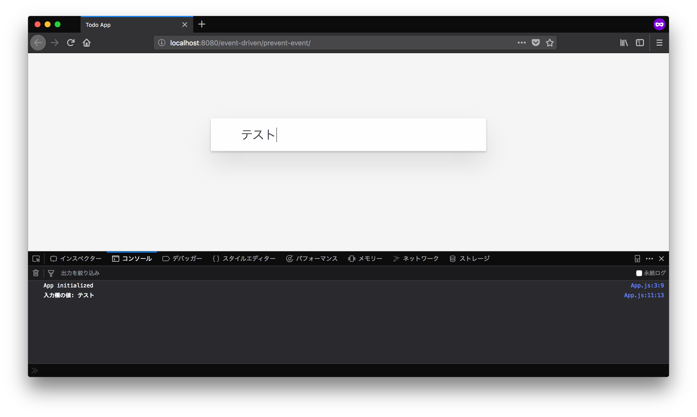

# Todoアプリとイベント駆動 {#todo-app-event-driven}

ここからはJavaScriptでTodoアプリの動作を実際に作っていきます。

まずは、先ほどHTMLに目印を付けたTodoリスト(`#js-todo-list`)に対してTodoアイテムを追加する処理を作っていきます。

## Todoアイテムの追加 {#add-todo-item}

Todoアイテムを追加するには、ユーザーが次のような操作によって追加します。

1. 入力欄にTodoアイテムのタイトルを入力する
2. 入力欄でEnterを押し送信する
3. TodoリストにTodoアイテムが追加される

これをJavaScriptで処理するには次のことが必要です。

- form要素から送信（`submit`）されたことをイベントで受け取る
- input要素（入力欄）に入力された内容を取得する
- 入力内容をタイトルにしたTodoアイテムを作成し、Todoリスト(`#js-todo-list`)にTodoアイテム要素を追加する

まずは、form要素から送信されたイベントを受け取り、入力内容をコンソールログに表示してみることから始めてみましょう。

## 入力内容をコンソールに表示 {#input-to-console}

form要素でEnterを押し送信すると`submit`イベントが発火されます。
この`submit`イベントは`addEventListener`メソッドを利用することで受け取れます。

<!-- doctest:disable -->
```js
// id="js-form`の要素を取得
const formElement = document.querySelector("#js-form");
// form要素から発火されたsubmitイベントを受け取る
formElement.addEventListener("submit", (event) => {
    // イベントが発火された時に呼ばれるコールバック関数
});
```

フォームが送信されたときに入力内容をコンソールに表示するには、
`addEventListener`コールバック関数内で入力内容をConsole APIで出力すればよいことになります。

入力内容はinput要素の`value`プロパティから取得できます。

<!-- doctest:disable -->
```js
const inputElement = document.querySelector("#js-form-input");
console.log(inputElement.value); // => "input要素の入力内容"
```

これらを組み合わせて`App.js`に「入力内容をコンソールに表示」する機能を実装してみましょう。
`App`クラスに`mount`というメソッドを定義して、次のようにform要素の`submit`イベントを受け取ります。
フォーム（`#js-form`）でEnterを押し送信すると、input要素（`#js-form-input`)に書かれていた内容が開発者ツールのコンソールに表示するという実装です。

[import, src/App.js](./prevent-event/src/App.js)

`index.js`も合わせて変更して、`App`クラスの`mount`メソッドを呼び出すようにします。

[import, index.js](./prevent-event/index.js)

これらの変更後にブラウザでページをリロードすると、`App#mount`が実行されるようになります。
`submit`イベントが監視されているので、入力欄に何か入力してEnterで送信してみるとその内容がコンソールに表示されます。



先ほどの`App.js`で発火されたsubmitイベントの`event.preventDefault();`を呼び出しています。
これは、`submit`イベントが発火されたフォーム本来の動作をキャンセルするメソッドです。
フォーム本来の処理とは、フォームの内容を指定したURLへ送信するといった処理です。
ここでは`form`要素に送信先が指定されていないため、現在のURLに対してフォームを送信が行われるのをキャンセルしています。

<!-- doctest:disable -->
```js
formElement.addEventListener("submit", (event) => {
    // submitイベントの本来の動作を止める
    event.preventDefault();
    console.log(`入力欄の値: ${inputElement.value}`);
});
```

現在のURLに対してフォームを送信が行われると、結果的にページがリロードされてしまいます。
これは`event.preventDefault();`をコメントアウトすると、ページがリロードされていることが確認できます。

```js
formElement.addEventListener("submit", (event) => {
    // preventDefaultしないとページがリロードされてしまう
    // event.preventDefault();
    console.log(`入力欄の値: ${inputElement.value}`);
});
```

## 入力内容をTodoリストに表示 {#input-to-todolist}

フォーム送信時に入力内容を取得する方法が分かったら、次はその入力内容をTodoリスト(`#js-todo-list`)に表示します。
