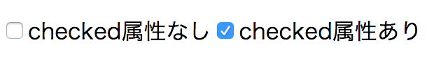

# Todoアイテムの更新と削除を実装する {#todo-item-update-and-delete}

このセクションではTodoアプリの残りの機能である「Todoアイテムの更新」と「Todoアイテムの削除」を実装していきます。

「Todoアイテムの更新」とは、チェックボックスをクリックして未完了だったらチェックを付けて完了済みに、逆完了済みのアイテムを未完了へとトグルする機能のことです。完了状態をTodoアイテムごとにもち、それぞれのTodoの進捗を管理できる機能です。

一方の「Todoアイテムの削除」はボタンをクリックしたらTodoアイテムを削除する機能です。
不要となったTodoを削除して完了済みのTodoを取り除くなどに利用できる機能です。

まずは「Todoアイテムの更新」から実装します。その後「Todoアイテムの削除」を実装していきます。

## Todoアイテムの更新 {#todo-item-update}

現時点ではTodoアイテムの完了済みかが表示されていません。
そのため、まずはTodoアイテムが完了済みかを表示する必要があります。
HTMLの[`<input type="checkbox">`](https://developer.mozilla.org/ja/docs/Web/HTML/Element/Input/checkbox)要素を使いチェックボックスを表示し、Todoアイテムごとの完了状態を表現します。

`<input type="checkbox">`要素は`checked`属性がない場合はチェックが外れ、
`<input type="checkbox" checked>`のように`checked`属性がある場合はチェックが付きます。



Todoアイテム要素である`<li>`要素中に次のように`<input>`要素を追加しチェックボックスを表示に追加します。
合わせて完了済みの場合は`<s>`要素を使い打ち消し線を表示しています。

[import marker:"checkbox",unindent:"true"](./add-checkbox/src/App.js)

`<input type="checkbox">`要素はクリックすると自動でチェックの表示が切り替わりますが、
このままでは表示とモデルの状態にずれが発生してしまいます。
たとえば、表示上はチェックが付いているのに、モデルの`TodoItemModel`の`completed`プロパティが`false`となるようなバグが発生してしまいます。

そのため、`<input type="checkbox">`要素がチェックされたらモデルの状態を更新する必要があります。
`<input type="checkbox">`要素はチェックされたときに`change`イベントを発火します。
この`change`イベントを監視して、TodoItemモデルの状態を更新すればモデルと表示の状態を同期できます。

`input`要素の`change`イベントを監視は次のようにかけます。

`input`要素は`todoItemElement`要素の下にあります。
`input`要素には目印として`class`属性に`checkbox`とつけておき、これを`querySelector`メソッドで探索します。
以前は`document.querySlector`で`document`以下からCSSセレクタで探索していました。
`todoItemElement.querySelector`メソッドを使うことで、`todoItemElement`下にある要素を探索できます。

見つけた`input`要素に対して`addEventListener`メソッドで`change`イベントハンドラを登録できます。

<!-- doctest:disable -->
```js
const todoItemElement = element`<li><input type="checkbox" class="checkbox">${item.title}</input></li>`;
// クラス名checkboxを持つ要素を取得
const inputCheckboxElement = todoItemElement.querySelector(".checkbox");
// `<input type="checkbox">`のチェックが変更されたときに呼ばれるイベントハンドラを登録
inputCheckboxElement.addEventListener("change", () => {
    // チェックボックスの表示が変わったタイミングで呼び出される処理
    // ここでモデルを更新する処理を呼ぶ
});
```

ここまでをまとめると、Todoアイテムの更新は次の2つのステップで実装できます。

1. `TodoListModel`に指定したTodoアイテムの更新処理を追加する
2. チェックボックスの`change`イベントが発生したら、モデルの状態を更新する

ここから実際にTodoアイテムの更新を`todoapp`プロジェクトに実装していきます。

###  `TodoListModel`に指定したTodoアイテムの更新処理を追加する {#TodoListModel-updateTodo}

まずは、`TodoListModel`に指定したTodoアイテムを更新するメソッドを追加します
次のように、`TodoListModel`に`updateTodo`メソッドを追加します。
`TodoListModel#updateTodo`メソッドは、指定したidと一致するTodoアイテムの完了状態(`completed`プロパティ)を更新します。

[import, marker:"add-point",unindent:"true"](./update-feature/src/model/TodoListModel.js)

### チェックボックスの`change`イベントが発生したら、モデルの状態を更新する {#onChange-update-model}

そして次に`input`要素の`change`イベントのイベントハンドラにモデルの更新処理を登録します。
次のように`App.js`で`input`要素の`change`イベントが呼び出されたら、`TodoListModel#updateTodo`メソッドを呼び出すようにします。
チェックがトグルするたびに呼び出されるので、`completed`には現在の状態を反転（トグル）した値を渡します。

[import, marker:"checkbox",unindent:"true"](./update-feature/src/App.js)

`TodoListModel#updateTodo`メソッド内では`emitChange`メソッドによって、`TodoListModel`の変更が通知されます。
これによって`TodoListModel#onChange`で登録されているイベントハンドラがよびだされ、表示が更新されます。

これで表示とモデルが同期でき「Todoアイテムの更新処理」が実装できました。

## 削除機能 {#delete}

次は「Todoアイテムの削除機能」を実装していきます。

基本的な流れは「Todoアイテムの更新機能」と同じです。
`TodoListMode`にTodoアイテムを削除する処理を実装し、削除ボタンがクリックされたときのイベントハンドラ内で指定アイテムを削除する処理を呼び出すだけです。

###  `TodoListModel`に指定したTodoアイテムの削除する処理を追加する {#TodoListModel-deleteTodo}

まずは、`TodoListModel`に指定したTodoアイテムを削除するメソッドを追加します。
次のように、`TodoListModel`に`deleteTodo`メソッドを追加します。
`TodoListModel#deleteTodo`メソッドは、指定したidと一致するTodoアイテムを削除します。

[import, marker:"add-point",unindent:"true"](./update-feature/src/model/TodoListModel.js)

### 削除ボタンの`click`イベントが発生したら、Todoアイテムを削除する {#onChange-update-model}

そして次に`input`要素の`change`イベントのイベントハンドラにモデルの更新処理を登録します。
次のように`App.js`で`button`要素の`todoItemElement`へ追加します。
追加する`button`要素には`delete`というクラス名をつけておき、この要素がクリック（`click`）されたときに呼び出されるイベントハンドラを登録します。
このイベントハンドラの中で`TodoListModel#deleteTodo`メソッドを呼びだし該当するTodoアイテムを削除します。

[import, marker:"checkbox",unindent:"true"](./update-feature/src/App.js)

`TodoListModel#deleteTodo`メソッド内では`emitChange`メソッドによって、`TodoListModel`の変更が通知されます。
これにより表示が`TodoListModel`と同期するように更新され、表示からもTodoアイテムが削除できます。

これで「Todoアイテムの削除機能」が実装できました。

## まとめ {#conclusion}

このセクションでは次のことできるようになりました。

- [x] Todoアイテムの完了状態を`<input type="checkbox">`を追加した
- [x] チェックボックスが更新時の`change`イベントのハンドラでTodoアイテムの更新した
- [x] Todoアイテムを削除するボタンを`<button class="delete">x</button>`を追加した
- [x] 削除ボタンの`click`イベントのハンドラでTodoアイテムを削除した
- [x] Todoアイテムの追加、更新、削除の機能が動作するのを確認できた

このセクションでTodoアプリに必要な要件が実装できました。

- [x] Todoアイテムを追加できる
- [x] Todoアイテムの完了状態を更新できる
- [x] Todoアプリムを削除できる

最後のセクションでは、`App.js`や表示に関するリファクタリングを行い、継続的に開発しやすいアプリの作り方についてを見ていきます。